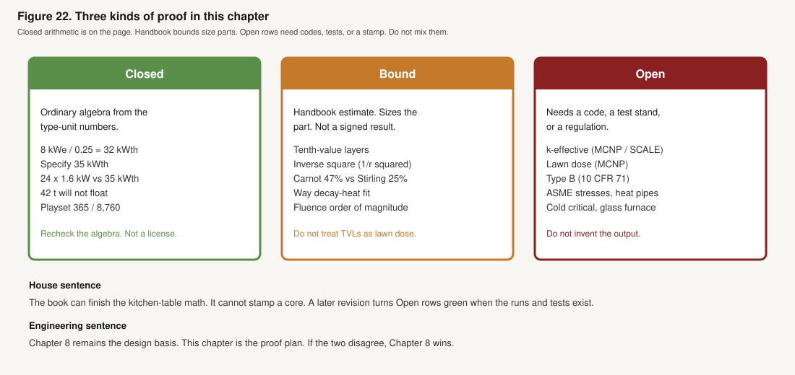
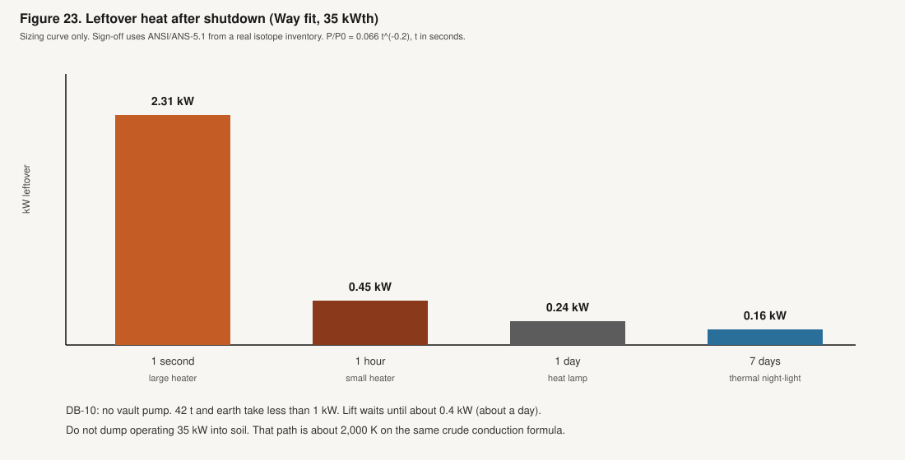
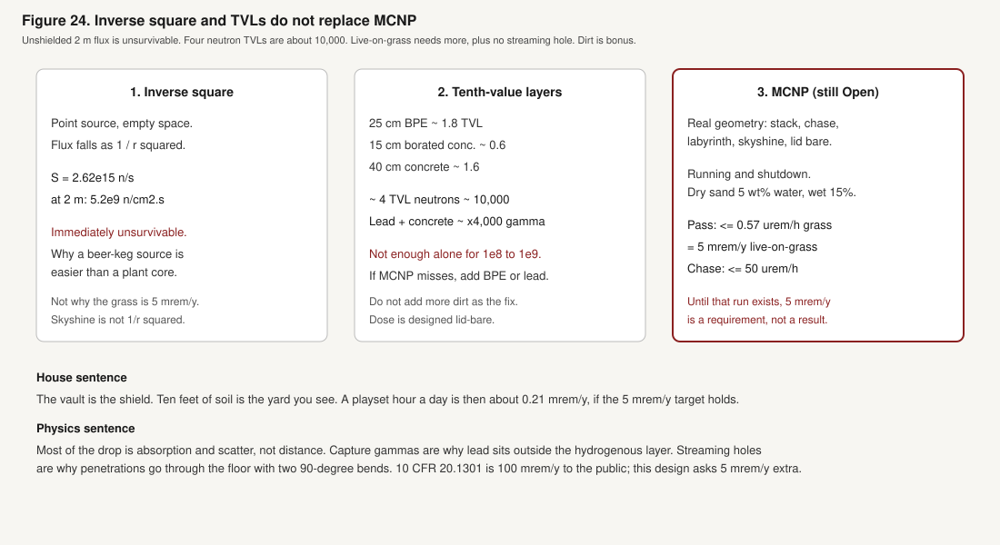
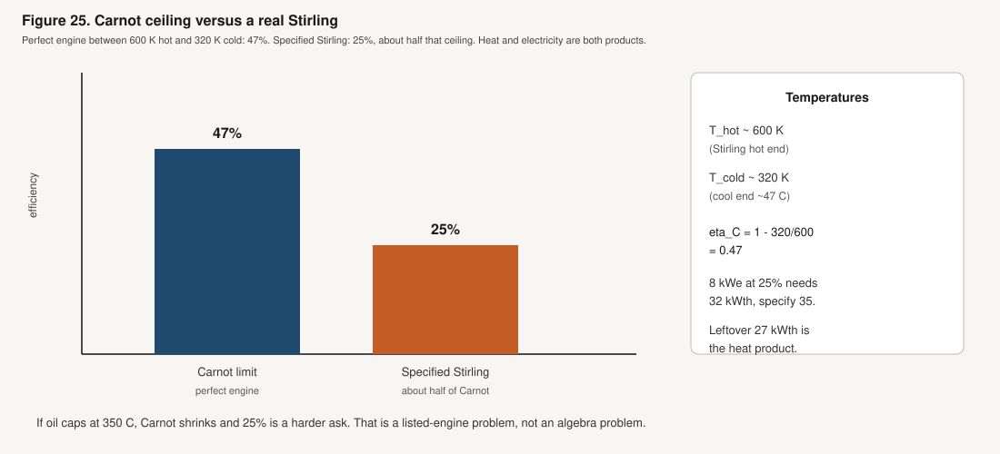
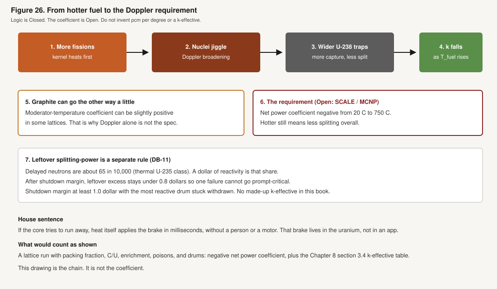

# The Proofs

**Chapters:** [1. The Need](1_The-Need.md) · [2. The Idea](2_The-Idea.md) · [3. Yard Safety](3_Yard-Safety.md) · [4. The House](4_The-House.md) · [5. The Vault](5_The-Vault.md) · [6. The Approval](6_The-Approval.md) · [7. The Swap](7_The-Swap.md) · [8. Vault Spec](8_Vault-Spec.md) · [9. The Fuel](9_The-Fuel.md) · **10. The Proofs**

← [Previous: 9. The Fuel](9_The-Fuel.md) · [Start](README.md) · [Whole book as a PDF](Backyard-1.4.pdf) · **End of the book.**

---

This chapter does not prove the machine. It says, for each design claim, what would count as shown, how you would show it, and what number means pass. Where ordinary arithmetic already closes the claim, the work is on the page. Where a transport code, a furnace, a drop pad, or a licensed cell is required, the row stays **open** and names the spec or test.

Chapter 8 is the design basis you size and buy against. Chapter 9 is why the insides are that machine. This file is the proof plan those two chapters were missing. If a number here and a number in Chapter 8 disagree, Chapter 8 wins, and this file should be updated to match.

Three kinds of statement appear below.

**Closed.** The arithmetic is finished in this book. Rechecking the algebra is enough. No MCNP, no drop test, no k-effective.

**Bound.** A handbook estimate that sizes the part or shows the claim is in a plausible range. It is not a signed result. The usual mistake is treating a tenth-value-layer stack as a lawn dose.

**Open.** Needs specialized software, a test article, a listed product, a licensed facility, or a regulation that does not yet have a house-appliance stamp. The row names what to run and what pass looks like.

Nothing in the **Open** column is filled in with a made-up computer output. Chapter 8 already forbids inventing a k-effective. The same rule holds here for dose, drum worth, burnup at year 100, and heat-pipe life.



---

## How to read a proof item

Each proof item is one claim from the design.

| Column | Meaning |
| --- | --- |
| Claim | What the book asserts, in one sentence |
| Status | Closed, Bound, or Open |
| Method | Arithmetic, handbook, named code, named test, or named rule |
| Pass | The number or behavior that means the claim is shown |
| Home | Where the requirement lives in Chapter 8 |

A **Closed** row can still fail if someone changes 8 kWe, 25% conversion, 35 kWth, 30 kg, or 100 years. Recheck the algebra. Do not treat Closed as a license.

---

## Closed arithmetic

These are the pieces that do not need a neutron-transport code. They use the type-unit numbers: **8.0 kWe**, **η = 0.25**, **35 kWth**, **30 kg** heavy metal at first start, **80 GWd/t** target, **100 years**, vault **~42 t**.

### Power: why 35 kW of heat

House-side conversion baseline is a free-piston Stirling at **25%** of heat to electricity (hot end about 350 to 600°C, cold end about 40 to 50°C).

```
P_th = 8.0 kWe / 0.25 = 32.0 kWth
P_th,spec = 32.0 x 1.10 = 35.2 kWth  →  specify 35 kWth
P_reject = 35 − 8 = 27 kWth
```

**Pass:** 8.0 kWe at the inverter DC bus with 35 kWth in the core and 27 kWth leftover as house heat, greenhouse heat, or dry-cooler reject. If conversion is only 8% (thermoelectric), the same 8 kWe needs 100 kWth. That is a different vault.

**Status: Closed** for the energy balance. **Open** for a listed Stirling that actually holds 25% at this temperature pair for a decade (that row is later).

### Annual electricity

```
8.0 kW x 8,760 h/y = 70,080 kWh/y
at 90% capacity factor: 8.0 x 8,760 x 0.90 = 63,072 kWh/y
```

**Pass:** nameplate energy is 70,080 kWh/y. Design energy at 90% capacity factor is 63,072 kWh/y. Peaks of 10 to 20 kW are the battery, not the core.

**Status: Closed.** Sell-back and the bill are Chapter 2, not physics.

### 100-year heat and heavy metal consumed

```
E = 35 kW x 8,760 h/y x 100 y = 30,660,000 kWh = 30,660 MWh
P = 0.035 MW
E = 0.035 MW x 365.25 d/y x 100 y = 1,278.4 MWd
```

Heavy metal consumed at discharge burnup B (megawatt-days per tonne):

```
m_consumed (t) = 1,278.4 / B
```

| Assumed discharge burnup | Heavy metal consumed | Notes |
| --- | --- | --- |
| 50 GWd/t | 25.6 kg | Conservative oxide-class |
| 80 GWd/t | 16.0 kg | TRISO-UCO target |
| 100 GWd/t | 12.8 kg | Aggressive TRISO |

Inventory at first start is larger than mass consumed (leftover fissile at year 100, burnable poison, critical geometry):

| Item | Value |
| --- | --- |
| Heavy metal at first start | **30 kg (66 lb)** |
| Consumed at 80 GWd/t, end of life | 16 kg (35 lb) |
| Residual heavy metal at end of life | about 14 kg in the same compacts |

**Pass:** 16 kg consumed at the 80 GWd/t target is algebra from 1,278.4 MWd. **30 kg at first start is a specification**, not a depletion result. Whether 30 kg with poisons and drums still holds k-effective at year 100 is **Open** (SCALE/ORIGEN).

**Status: Closed** for energy and the consumed-mass table. **Open** for end-of-life criticality.

### Fission rate and U-235-equivalent consumed

Energy per fission: 200 MeV = 200 × 1.602×10⁻¹³ J = **3.204×10⁻¹¹ J**.

```
R_f = 35,000 J/s  /  3.204×10⁻¹¹ J  =  1.092×10¹⁵ fissions/s
```

Per year (365.25 days = 3.15576×10⁷ s):

```
N_y = 1.092×10¹⁵ x 3.15576×10⁷ = 3.447×10²² fissions/y
m_U235-eq = 3.447×10²² / 6.022×10²³ x 235 g = 13.45 g/y
100 y → 1.35 kg U-235-equivalent fissioned
```

Some fissions at mid-life are Pu-239. The 1.35 kg is fission-equivalent, not a claim that only U-235 fissions.

Initial U-235 in 30 kg of 19.75 wt% U:

```
0.1975 x 30 kg = 5.93 kg U-235
```

**Pass:** 1.35 kg fission-equivalent over 100 years at 35 kWth. Several kilograms of fissile remain. End of life is not an empty tank.

**Status: Closed** for the fission count. **Open** for the mix of U-235 vs Pu-239 vs leftover (ORIGEN).

### Decay heat after shutdown

Way / ANS-style fit for sizing, infinite prior operation: P/P₀ ≈ 0.066 t⁻⁰·² with t in seconds.

| Time after shutdown | t (s) | t⁻⁰·² | P/P₀ | P (kW) | Household analog |
| --- | --- | --- | --- | --- | --- |
| 1 s | 1 | 1.000 | 0.066 | 2.31 | Large space heater |
| 1 h | 3,600 | 0.194 | 0.0128 | 0.45 | Small space heater |
| 1 d | 86,400 | 0.103 | 0.0068 | 0.24 | Heat lamp |
| 7 d | 6.05×10⁵ | 0.0697 | 0.0046 | 0.16 | Night-light class, thermal |

Lift waits until decay heat is under about 0.4 kW (about a day). **DB-10:** no vault-side pump for leftover heat. Vault mass (~42 t) and earth take less than 1 kW.

Crude earth conduction, vault as a sphere r = 1.4 m, soil k = 1.0 W/m·K, Q = 0.5 kW:

```
ΔT = Q / (4 π k r) = 500 / (4 x 3.1416 x 1.0 x 1.4) = 28 K
```

Soil far-field plus about 28°C at the wall after a few hours. Acceptable for decay heat. **Do not use this formula for operating 35 kW.** If 35 kW were dumped to soil: ΔT ≈ 1,990 K. Operating heat leaves through heat pipes, then oil, then a dry cooler or a greenhouse.



**Pass (sizing):** leftover heat is heater-class in an hour and lamp-class in a day. **Pass (sign-off):** a decay-heat curve from a depletion inventory (ANSI/ANS-5.1 or equivalent, built from ORIGEN isotopes), not this fit alone.

**Status: Bound** for the table (good enough to size the box). **Open** for the isotope-true curve.

### Pipe count versus 35 kW

| Count | Capacity at 1.6 kW each | Versus 35 kWth |
| --- | --- | --- |
| 24 operating | 38.4 kW | 3.4 kW margin |
| 23 (one dead) | 36.8 kW | still above 35 |
| 22 (two dead) | 35.2 kW | still above 35 |
| 21 (three dead) | 33.6 kW | derate electrical output |

Four spare channels are plugged. Rating 1.6 kW each at about 600°C vapor is a **vendor rating to be shown**, not a number this chapter can certify.

**Pass (count):** 24 × 1.6 kW ≥ 35 kWth with two pipes out. **Pass (hardware):** a heat-pipe test that holds 1.6 kW at the design temperatures, plus a failed-pipe test on a representative block.

**Status: Closed** for the count. **Open** for the 1.6 kW rating and 100-year life.

### Oil flow at 35 kW

Dowtherm A class, ΔT = 40 K, c_p ≈ 2.2 kJ/kg·K:

```
m = 35 / (2.2 x 40) = 0.40 kg/s  ≈  6 to 7 gpm
```

**Pass:** process flow about 0.40 kg/s in 25 mm inner pipe plus 40 mm containment, two pipes (hot and return) in the chase. Pump in the utility room, not in the vault.

**Status: Closed** for the flow. **Open** for listed pipe, leak detection, and fire (NFPA row later).

### Vault mass versus float

Type-unit mass ~42,100 kg (46.4 short tons). Footprint ≈ π × 1.23² = 4.75 m².

```
q = 42,100 x 9.81 / 4.75 = 87 kPa  ≈  1.8 ksf
```

Most residential soils are 1.5 to 3 ksf allowable. Spec a 200 mm crushed-stone pad.

Displaced volume ≈ π × 1.23² × 2.60 = 12.3 m³. Full flood:

```
12.3 m³ x 1,000 kg/m³ = 12.3 t  <<  42 t
```

**Pass:** vault does not float. No buoyancy straps. Still grout the pad so it does not walk in a scour hole. Lead and concrete takeoffs on the shop drawing must close to this mass.

**Status: Closed** for buoyancy with the type-unit takeoff. **Open** for the civil drawing and soil report.

### Playset arithmetic

Live-on-grass target is **≤5 mrem/year** if someone sat there 8,760 hours. Playset at 1 hour a day:

```
5 mrem/y x (365 h / 8,760 h) = 0.21 mrem/y
```

A coast-to-coast flight is about 3 to 5 mrem. A playset year is about 1/15 to 1/25 of one flight.

Hourly rate that yields 5 mrem in 8,760 h:

```
5 mrem / 8,760 h = 0.00057 mrem/h = 0.57 µrem/h
```

**Pass (arithmetic):** 0.21 mrem/y at 1 h/d follows from 5 mrem/y. **Pass (dose):** MCNP shows ≤0.57 µrem/h at the grass, dry soil, lid buried and lid bare.

**Status: Closed** for the 365/8,760 ratio. **Open** for the 5 mrem/y itself.

### Core volume, power density, order-of-magnitude fluence

```
Active core: 400 mm diameter x 500 mm height
Volume: π x 0.20² x 0.50 = 0.0628 m³ = 62.8 L
Power density: 35 kW / 62.8 L = 0.56 kW/L
```

A typical US water-plant core is about 100 kW/L. This core is about **200 times** less dense.

```
HM loading: 30 kg / 62.8 L = 0.48 g/cm³
```

TRISO compacts routinely hold 0.5 to 1.0 g/cm³ heavy metal. 0.48 is not cramped.

Fission density:

```
1.092×10¹⁵ /s  /  6.28×10⁴ cm³  =  1.74×10¹⁰ fissions/cm³·s
```

If the macroscopic fission cross section Σ_f is about 0.08 to 0.15 cm⁻¹ (from the lattice, not from this page):

```
φ  ~  (1.74×10¹⁰) / Σ_f  ≈  1×10¹¹ to 2×10¹¹ n/cm²·s
t_100y = 3.15576×10⁹ s
Φ  ~  3×10²⁰ to 7×10²⁰ n/cm²
```

That is research-reactor cladding fluence, not a 40-year water-plant barrel. Stainless, graphite, and TRISO silicon carbide are in a plausible range. **Displacements per atom and graphite shrinkage still need a materials memo.**

**Pass (geometry):** 0.56 kW/L and 0.48 g/cm³ are algebra. **Pass (materials):** a fluence and dpa assessment against AGR/HTGR and graphite data at this flux and 100 years.

**Status: Closed** for volume and power density. **Bound** for fluence (Σ_f is assumed). **Open** for dpa and shrinkage.

### Source terms for shielding (running, 35 kWth)

```
Neutrons: ~2.4 n/fission x 1.092×10¹⁵ = 2.62×10¹⁵ n/s
Gamma energy (prompt ~7 MeV/fission):
  7×10⁶ eV x 1.602×10⁻¹⁹ J/eV x 1.092×10¹⁵ = 1.22 kW gamma
```

Unshielded neutron flux at 2 m, isotropic point source, no shield:

```
Φ = S / (4 π r²) = 2.62×10¹⁵ / (4 π x 4×10⁴ cm²) = 5.2×10⁹ n/cm²·s
```

That is immediately unsurvivable. The shield is not optional. Capture gammas in hydrogen and iron are extra, and are why lead sits **outside** the hydrogenous layer.

**Status: Closed** for the source magnitude. **Open** for dose after the stack (MCNP).

### Stored energy in a short jump

```
35 kW x 10 s = 350 kJ  (one-tenth of a kWh)
```

A prompt jump that self-limits in milliseconds dumps a small energy into a large graphite and steel mass. There is no 3 GWth inventory.

**Status: Closed** for 350 kJ. **Open** for the actual prompt-energy deposition from a reactivity insertion (that needs the lattice and delayed-neutron fraction).

---

## Handbook bounds that are not a substitute for transport

These estimates size the shield and the engine. They do not replace MCNP, and they do not replace a measured Stirling efficiency.

### Tenth-value layers

A tenth-value layer (TVL) is the thickness that cuts a given radiation to one-tenth, for a stated spectrum. Approximate, fission-spectrum neutrons / ~1 to 2 MeV gamma:

| Material | TVL neutrons (fission) | TVL gamma (~1.5 MeV) |
| --- | --- | --- |
| Borated polyethylene | ~12 to 15 cm | poor (use lead) |
| Concrete | ~20 to 28 cm | ~20 to 24 cm |
| Lead | poor | ~4.0 to 4.5 cm |
| Dry soil | worse than wet by ~1.5 to 2× for neutrons | ~25 to 35 cm |
| Wet soil | closer to concrete for neutrons | ~20 to 30 cm |

Neutron path (radial, type-unit stack): 25 cm BPE (~1.8 TVL) + 15 cm borated concrete (~0.6 TVL) + 40 cm concrete (~1.6 TVL) ≈ **4 TVL ≈ 10⁴** before soil.

Gamma path: 8 cm lead ≈ 1.8 TVL (×63) plus 40 cm concrete ≈ 1.8 TVL (×63) ≈ **×4,000** plus soil.

Unshielded flux at 2 m was 5.2×10⁹ n/cm²·s. Four TVL of neutrons is a factor of 10,000: still on the order of 10⁵ n/cm²·s if you treated the core as a point and ignored everything else. Live-on-grass needs something more like 10⁸ to 10⁹ of total attenuation, plus a gamma story, plus no streaming hole. **4 TVL is not enough alone.** The reflector, boron capture in the polyethylene, self-shielding in a small core, and 1/r² as you move out through thick layers have to be in a transport model.

**If the model misses DB-5 or DB-6, add BPE or lead. Do not add “more dirt” as the fix.** Dirt is bonus. Dose is designed with the lid bare.

### Inverse square (1/r²)

For a point source in empty space, flux falls as 1/r². The core is not a point, and the yard is not empty space. Inverse square is why a beer-keg source is easier to bury than a plant core, and why a 2 m unshielded number is already a crisis. It is **not** why the grass is 5 mrem/y. Most of the drop is absorption and scatter in BPE, concrete, and lead.

Skyshine with the lid bare is a scatter path that inverse square does not capture. That is an MCNP tally.



**Pass (handbook):** the stack is a geometry that can plausibly meet DB-5 and DB-6 once transport is run. **Pass (sign-off):** MCNP6 or equivalent, running and shutdown, dry sand (5 wt% water) and wet (15 wt%), lid buried and lid bare, chase streaming, skyshine with lid bare, contact on bare shell for a 1-hour worker exposure under 100 mrem.

**Status: Bound** for TVL and 1/r². **Open** for every dose number on the lawn.

### Carnot versus 25% Stirling

A perfect heat engine between two temperatures cannot beat Carnot:

```
T_hot  ≈ 600 K   (Stirling hot end, order of 327°C)
T_cold ≈ 320 K   (about 47°C cool end)
η_Carnot = 1 − 320/600 = 0.47   (47%)
```

A real Stirling at **25%** is about **half of that ceiling**. That is a normal real engine, not a calculation error. Heat and electricity are both products. The 27 kWth leftover is not a defect.

If the oil loop caps at 350°C, the hot-end Kelvin number is lower and Carnot shrinks. Then 25% is a harder ask, or the convertor runs a bit less efficiently and you size five 2 kWe units with margin (10 kWe installed for 8 kWe net).



**Pass (bound):** 25% is under 47% at this temperature pair. **Pass (hardware):** a listed convertor at the oil temperature the chase actually delivers, five units, 8 kWe net, 10 to 15 year swap in the utility room.

**Status: Bound** for Carnot. **Open** for the measured 25%.

---

## From “hotter means less splitting” to the Doppler requirement

No coefficient is invented here. The chain is the requirement the lattice model must meet.

**House sentence.** If the core tries to run away, heat itself applies a brake in milliseconds, without a person or a motor. That brake lives in the uranium.

**Step 1.** A fission dumps most of its energy as fragments stopping inside the kernel. Kernel temperature rises first. Graphite and the heat pipes lag.

**Step 2.** U-238 (and U-235) have narrow energy traps, **resonances**, where a neutron is very likely to be captured instead of going on to split. Between the traps, a neutron can slip through.

**Step 3.** Heat is motion of the nuclei. To a neutron, a jiggling trap looks wider. That widening is **Doppler broadening**. More neutrons fall into U-238 capture. Fewer are left to split U-235.

**Step 4.** So as fuel temperature rises, k-effective falls. The fuel-temperature coefficient is negative. That is the millisecond brake.

**Step 5.** Graphite, getting hotter, can go slightly the other way in some layouts (spectrum shifts, less density, a few more neutrons in the wrong band). That is a **moderator-temperature** coefficient, and it can be slightly positive.

**Step 6.** The design rule is not “Doppler exists.” The design rule is: **from 20°C to 750°C, the net power coefficient is negative.** Hotter still means less splitting overall, after fuel and graphite have both moved. That is a hard SCALE/MCNP criterion on the real lattice (packing fraction, carbon-to-uranium, enrichment, poisons, drums).

**Step 7.** Doppler does not get a free pass on leftover splitting-power. Delayed neutrons are about **65 in 10,000** of the new neutrons (thermal U-235 class). If you add more splitting-power than that tiny share all at once, the chain can speed up on the immediate neutrons alone. **DB-11:** after shutdown margin, leftover excess stays **under 0.8 dollars** of reactivity so a single failure cannot make the core prompt-critical. Shutdown margin at least **1.0 dollar** with the most reactive drum stuck withdrawn.

A dollar of reactivity is that delayed-neutron share. This file does not print a made-up k-effective, a made-up pcm per degree, or a made-up drum worth.



**Pass:** the lattice model shows a negative net power coefficient 20°C to 750°C, and the §3.4 k-effective table, including DB-11. **Not a pass:** this paragraph.

**Status: Open** (MCNP/SCALE). The chain is Closed as logic. The number is not.

---

## Proof items

Status is **Closed**, **Bound**, or **Open**. Pass is what a reviewer should see.

### Power, inventory, size

| Claim | Status | Method | Pass | Home |
| --- | --- | --- | --- | --- |
| 8.0 kWe needs 35 kWth at 25% conversion with 10% margin | Closed | Algebra | 8/0.25 = 32; ×1.10 → specify 35; reject 27 kWth | DB-1, DB-2, §2.1 |
| 70,080 kWh/y nameplate; 63,072 kWh/y at 90% CF | Closed | Algebra | 8 × 8,760; ×0.90 | §2.2 |
| 1,278 MWd in 100 years at 35 kWth | Closed | Algebra | 0.035 MW × 365.25 × 100 | §2.3 |
| 16 kg heavy metal consumed at 80 GWd/t | Closed | Algebra | 1,278.4 / 80,000 t | §2.3 |
| 30 kg at first start is enough leftover fissile at year 100 | Open | SCALE/ORIGEN + lattice | k-effective(EOL) ≥ 1 with drums; peak compact ≤ 80 GWd/t | §2.3, §3.4, §16 |
| 1.35 kg U-235-equivalent fissioned in 100 years | Closed | 200 MeV/fission | 1.092×10¹⁵ fissions/s → 13.45 g/y × 100 | §2.4 |
| 5.93 kg U-235 at first start (19.75% of 30 kg) | Closed | Algebra | 0.1975 × 30 | §2.4 |
| Enrichment stays below 20% (HALEU, not HEU) | Closed as spec | Assay at fabrication | 19.75 ± 0.20 wt% U-235; no lot above 20% | §3.2 |
| Decay heat is heater-class, not plant-class | Bound | Way fit; then ANS-5.1 | ~2.3 kW at 1 s; ~0.45 kW at 1 h; ~0.24 kW at 1 d | §2.5, DB-10 |
| 350 kJ in a 10 s jump at 35 kW | Closed | Algebra | 35 kW × 10 s | §7.4 |
| Core 62.8 L, 0.56 kW/L, ~200× less dense than a PWR | Closed | Algebra | π×0.20²×0.50; 35/62.8 | §3.3 |
| Fluence ~3×10²⁰ to 7×10²⁰ n/cm² in 100 years | Bound | Fission density / assumed Σ_f | Order of research-reactor cladding, not a PWR barrel | §3.5 |
| Graphite shrinkage and dpa are acceptable at 100 years | Open | Materials memo vs AGR/HTGR and graphite data | Allowables on dimensional change, strength, conductivity | §3.5, §16, §17 |

### Neutronics (do not invent k-effective)

| Claim | Status | Method | Pass | Home |
| --- | --- | --- | --- | --- |
| Factory / truck: subcritical with drums in | Open | MCNP6 or Serpent + SCALE/KENO | k-effective ≤ 0.95 including 3σ and tolerances | §3.4, DB-9 |
| Hot, xenon equilibrium, beginning of life | Open | Same | 1.000 ≤ k-effective ≤ 1.005, drums not on a stop | §3.4 |
| End of life, poisons depleted | Open | Depletion + lattice | k-effective ≥ 1.000 with drums at max remaining worth | §3.4 |
| Most reactive drum stuck out, others in | Open | Lattice | k-effective ≤ 0.99 | §3.4 |
| Shutdown margin ≥ 1.0 dollar, most reactive drum stuck withdrawn | Open | Lattice, worth in dollars | ≥ 1.0 dollar | §3.4 |
| Leftover excess after shutdown margin under 0.8 dollars | Open | Lattice | Under 0.8 dollars so one failure cannot go prompt | DB-11 |
| All drums out, cold, clean (beyond design) still below prompt-critical | Open | Lattice | Below prompt-critical; DB-11 | §3.4 |
| Flooded inner vessel: k-effective decreases or stays subcritical | Open | Lattice, void and flooded | Analyze both ways; must not go prompt | §3.4, DB-8 |
| Net power coefficient negative, 20°C to 750°C | Open | Temperature-dependent lattice | dk/dP < 0 over that range (Doppler plus graphite) | §7.1 |
| Six B₄C drums, mechanical locks for transport | Open as hardware | Factory test + I&C | Locks pin absorbing face in; owner key does not exist | §3.4, §10 |
| Burnable poison holds the century (drums move a few degrees per decade) | Open | Depletion | Drum motion slow; no weekly chase | §3.2, §3.4 |
| Exact heat-pipe and compact lattice | Open | MCNP/SCALE geometry | Meets the table above at 24 pipes, 80 to 120 compact channels | §3.3 |

### Shielding and dose

| Claim | Status | Method | Pass | Home |
| --- | --- | --- | --- | --- |
| Unshielded neutron source ~2.62×10¹⁵ n/s | Closed | 2.4 n/fission × fission rate | Order 10¹⁵ n/s | §6.1 |
| Unshielded flux at 2 m ~5×10⁹ n/cm²·s | Closed | 1/r² point source | Shield is mandatory | §6.1 |
| Radial stack ~4 TVL neutrons, ~×4,000 gamma before soil | Bound | Handbook TVL | Geometry for MCNP, not a lawn number | §6.4 |
| Extra dose at grass ≤5 mrem/y, dry soil, running, 8,760 h | Open | MCNP6 | ≤0.57 µrem/h; DB-5 | DB-5, §6.2 |
| Same 5 mrem/y with lid bare (scour) | Open | MCNP6, skyshine | DB-6 | DB-6 |
| Dry sand 5 wt% water still meets DB-5 | Open | MCNP6 | Dry and wet (15 wt%) cases | §6.4, §11 |
| Playset 1 h/d ~0.21 mrem/y | Closed | 5 × 365/8,760 | Follows if DB-5 holds | §6.5 |
| Chase after two bends ≤50 µrem/h contact | Open | MCNP chase model | ≤50 µrem/h house-end pipe | §9 |
| Bare-shell 1-hour unplanned exposure <100 mrem | Open | MCNP tally on outer shell | Worker number, not a playset number | §11 |
| Public dose also under 10 CFR 20.1301 | Open | 10 CFR 20 + MCNP | 100 mrem/y TEDE is the federal cap; design is 5 mrem/y extra at the grass | DB-5; 10 CFR 20.1301 |

### Heat transport

| Claim | Status | Method | Pass | Home |
| --- | --- | --- | --- | --- |
| 24 × 1.6 kW = 38.4 kW > 35 kWth | Closed | Algebra | Count with two pipes out still ≥35 | §4.1 |
| Each pipe actually carries 1.6 kW at ~600°C vapor | Open | Transient heat-pipe model + test | 1.6 kW rating; startup from freeze; one failed-pipe test | §4.1, §16 |
| 100-year sealed heat-pipe life | Open | Life test / qualified extrapolation | Design life 100 y; fail-in-place + N+2 is the operational net | §4.1, §17 |
| Sodium stays in the tube (single envelope; inner vessel is second barrier) | Bound as design | Helium leak on vessel; pipe QA | He leak ≤ 1×10⁻⁸ mbar·L/s on inner vessel; pipe fail freezes in place | §4.1 |
| Oil 0.40 kg/s, 350°C, double-wall, leak-detected | Closed for flow; Open for listing | Algebra + NFPA / local fire | 0.40 kg/s; annulus detected; trip on leak | §4.3 |
| No vault pump required for core cooling or decay heat | Bound | Heat pipes + 42 t + earth ΔT~28 K at 0.5 kW | DB-10; do not dump 35 kW to soil | DB-10, §2.5 |
| Oil pump off / Stirling off trips drums | Open | Analog two-channel test | Condenser T high → springs in, no software, no phone | §4.4, §7.2, §10.2 |
| Startup from cold sodium (melts 98°C) | Open | Trace heat or NaK subset test | Licensed startup only; then lock out heater | §4.1, §10 |

### Mechanical, civil, transport package

| Claim | Status | Method | Pass | Home |
| --- | --- | --- | --- | --- |
| Vault ~42 t, 2.46 m OD × 2.60 m H | Bound | Takeoff in §8.1 | Shop drawing closes mass and geometry | §8.1 |
| Bearing ~1.8 ksf on 4.75 m² | Closed as arithmetic | 42,100 kg × 9.81 / 4.75 m² | Pad 200 mm stone or thin mat if geotech says no | §8.2 |
| Will not float in full flood (12 t buoyant vs 42 t) | Closed | Displaced 12.3 m³ | No buoyancy straps | §8.2, DB-8 |
| Inner vessel ≤0.5 MPa, SS316L, 12 mm | Open | ASME BPVC VIII or III (Div. 5 if high-T nuclear) | Stress < allowables; He leak test | §3.3, §16 |
| Pad, lift lugs, seismic box | Open | ASME + ASCE 7 / ASCE 43, IBC site class D, 0.3 g | Stress < allowables; 4 trunnions, 2 × 25 t WLL redundant | §8.3, §11 |
| Fueled vault is a Type B package | Open | 10 CFR 71 (71.51, 71.73) | Drop, puncture, 800°C / 30 min fire, immersion; k-effective stays down | §8.3, §11, §16 |
| Outer shell IP68 / submarine weld | Open | Shop hydro / helium | Indefinite immersion, inner boundary leak-tight | §11, DB-8 |
| 3.0 m (10 ft) soil above lid | Closed as spec | Civil | Cover is the yard; dose still lid-bare | §8.4, DB-6 |
| Penetrations floor only, two 90° bends | Closed as spec; Open for streaming | Drawings + MCNP | No lid penetration; chase ≤50 µrem/h | DB-7, §9 |

### Conversion, house, fire

| Claim | Status | Method | Pass | Home |
| --- | --- | --- | --- | --- |
| 5 × 2.0 kWe Stirling, 4 of 5 for 8 kWe | Open | UL listing of convertor class; factory test | 8 kWe net at DC bus; 10 to 15 y swap in utility room | §5, DB-1 |
| Inverter / gateway | Open | UL 1741, IEEE 1547 | Listing; islanding needs the gateway | §5, §13 |
| Battery 27 to 40 kWh, 10 to 15 kW peak | Open | Listed storage | Peaks are the battery | §5, §13 |
| 27 kW dry cooler | Open | HVAC coil rating | Summer reject; do not dump 35 kW to dirt | §4.4, DB-4 |
| Oil fire / leak in yard or utility room | Open | NFPA 30 (flammable liquids) / local fire; double-wall | Detected annulus; spill is hazmat, not a core event | §4.3, §16 |
| Hydronic 80 to 120°F isolated from potable | Open | Plumbing code + listed plate HX | 27 kWth house product | DB-4, §13 |
| Convertor is not in the vault | Closed as design | Architecture | 100-year Stirling inside the vault is not claimed | §5, §17 |

### Fuel, glass dump, cold critical

| Claim | Status | Method | Pass | Home |
| --- | --- | --- | --- | --- |
| TRISO-UCO 19.75% is a qualified fuel class for this burnup and temperature | Open | AGR/HTGR irradiation data + lot tests; NRC coated-particle fuel qualification | Failure fraction vs source term at 650 to 750°C compact, 80 GWd/t | §3.1, §3.2, §16 |
| Fission gas stays in the TRISO buffer | Open | Fuel QAP + particle tests | No vented fuel; sealed vault | §3.2 |
| Glass dump flows, sets, and kills reactivity | Open | Furnace mockup on a dummy lattice | Plug 750 ± 20°C; boron worth; no vessel cut | DB-12, §7.3 |
| Glass dump is not credited until that test exists | Closed as policy | Spec | Not in the licensing basis until tested | DB-12, §7.3 |
| Cold critical at the factory matches the model | Open | Licensed cell, zero-power physics test | Measured k-effective and drum worth vs model | §12, §16 |
| Fresh core is cold on the truck | Closed as spec; Open as procedure | Locks + transport criticality (10 CFR 71) | FACTORY_SHUTDOWN / TRANSPORT, drums locked in | DB-9, §10 |

### Safety functions (the stack)

| Claim | Status | Method | Pass | Home |
| --- | --- | --- | --- | --- |
| No water in the core to lose | Closed as design | Architecture | No LOCA path of that type | §3, §7 |
| One or two dead heat pipes are ordinary faults | Closed for count; Open for test | Algebra + failed-pipe test | 22 pipes still ≥35 kW | §4.1, §7.2 |
| Analog drum trip, two channels, no phone | Open | I&C qualification (IEEE 323/344 class if claimed nuclear) | Condenser T, drum disagree, licensed key trip | §10.2 |
| Owner cannot move drums | Closed as spec; Open as hardware | Locks, no owner key, app status only | App is not a control room | §10.2 |
| Last-ditch glass is last | Bound as design | 750°C plug vs 600°C vapor | Expected use: once in never | §7.3 |

---

## What still needs outside testing, codes, or a stamp

This is the work Chapter 8 §16 listed as a checklist, written so a reader can see **what**, **with what**, **against which rule**, and **what pass looks like**. Until these rows are green, the book is a design specification, not a signed reactor.

### Neutronics and depletion

**What.** k-effective in every §3.4 state; drum worth; flood; temperature coefficients; 100-year depletion.

**Software.** MCNP6 or Serpent for transport. SCALE/KENO as the independent check. ORIGEN (in SCALE) or Serpent depletion for burnup, poisons, and leftover fissile. A real lattice: compact channels, 24 heat pipes, 6 drums, reflector, inner vessel.

**What you cannot use instead.** This chapter. A handbook six-factor formula. A copied k-effective from Kilopower or eVinci (wrong size, wrong life, wrong packing).

**Pass.** The §3.4 table, DB-11 (under 0.8 dollars leftover), shutdown margin ≥ 1.0 dollar with the most reactive drum stuck withdrawn, net power coefficient negative 20°C to 750°C, k-effective(EOL) ≥ 1 with drums, peak compact ≤ 80 GWd/t.

**Who.** A nuclear-analysis shop with those codes, an independent peer check, then a cold-critical in a licensed cell.

### Shielding and public dose

**What.** Dose at grass, lid bare, dry and wet soil, chase streaming, skyshine, bare-shell worker tally.

**Software.** MCNP6 or equivalent with the §6.3 stack, floor labyrinth, and chase. Running and shutdown sources from the depletion inventory, not from a single 2.4 n/fission number alone.

**Regulation.** Design target DB-5 / DB-6 (5 mrem/y live-on-grass). Federal public cap **10 CFR 20.1301** (100 mrem/y TEDE). Occupational numbers for set and take-back under **10 CFR 20** subpart C. If someone cheaps the BPE, dirt is not the shield: DB-6 is the enforcement.

**Pass.** ≤0.57 µrem/h at the grass in the running dry-sand lid-bare case; chase ≤50 µrem/h; 1-hour bare-shell <100 mrem.

**Who.** Shielding analyst plus a survey plan for first units (you cannot skip the meter after the model).

### Heat pipes

**What.** Startup from frozen sodium, steady 1.6 kW, one or two pipes failed in a block, freeze/thaw, long-life extrapolation.

**Equipment.** Heat-pipe vendor stand (ACT / Thermacore class): calorimetry, wick dryout, non-condensable gas. A graphite or electrically heated mock lattice for the failed-pipe test. Sodium handling in a qualified lab.

**There is no 100-year certificate on the shelf.** Tests of this class have run for years, not a century in a buried house appliance. Qualification is a test program plus conservative life models, plus fail-in-place and four plugged spares.

**Pass.** 35 kWth with two pipes out; startup procedure that does not over-heat the compact; documented life case for 100 years or an honest derate of the life claim.

### Vessel, pad, lift, seismic

**What.** Inner vessel, outer shell, trunnions, pad, soil, earthquake.

**Codes.** **ASME Boiler and Pressure Vessel Code** Section VIII (shop vessel) or Section III (nuclear), including **Section III Division 5** if the high-temperature graphite and metallic core support is in the nuclear class. Welds **ASME IX**. **ASCE 7** and **IBC** for the site; **ASCE 43** if the vault is treated as a nuclear structure. Soil: geotech report, 200 mm crushed stone or a thin mat.

**Pass.** Stresses under allowables at ≤0.5 MPa inner design pressure, lift, 0.3 g site class D, flood external pressure. Helium leak ≤ 1×10⁻⁸ mbar·L/s on the inner vessel.

### Type B transport of a fueled vault

**What.** The vault on the highway is a radioactive-material package, not a septic tank with a permit.

**Regulation.** **10 CFR 71**. Type B tests under **71.73**: 9 m drop, puncture, 800°C for 30 minutes, immersion. Containment and shielding after the tests: **71.51**. Criticality safety of the package: **71.55 / 71.59**. International twin is IAEA SSR-6 if it ever leaves the US pattern.

**Equipment.** Drop pad, furnace or pool fire, immersion tank. A certified package design, not a paper claim.

**Pass.** After the hypothetical accident tests, containment holds, dose rates meet 71.51, and k-effective stays down (glass dump may fire; that is acceptable if the core stays subcritical).

**This is a real cost and a real year-count.** Do not skip it.

### Fuel qualification

**What.** Particle failure fraction at this temperature, burnup, and fluence; source term if particles fail; lot tests at the fabricator.

**Data and rules.** Existing **AGR / HTGR** irradiation and safety-test data for TRISO-UCO. NRC path for coated-particle fuel (fuel qualification for advanced reactors). Fabrication **quality assurance** (NQA-1 / 10 CFR 50 Appendix B if the license is Part 50/52). Assay and enrichment control so no lot is HEU.

**Equipment.** Fuel line (BWXT / X-energy class), post-irradiation examination at a hot cell, compact and particle QA (radiography, leach, burn-leach).

**Pass.** Failure fraction low enough that the vault source term still meets DB-5 and 10 CFR 20 even in the bounding failed-particle case. Peak compact 80 GWd/t is inside the qualified envelope, or the envelope is extended with new irradiations.

### Glass dump

**What.** 80 kg borosilicate frit + 15 kg B₄C, fusible plug 750 ± 20°C, gravity pour into channels, glass wets and sets, boron worth.

**Equipment.** Furnace mockup of a dummy lattice. Not a computer sketch.

**Regulation.** No existing “glass dump” rule. Treat it as a unique safety-related structure: test, then take credit. Until the furnace test exists, **DB-12 is not credited**.

**Pass.** Plug melts in the window, flow fills the intended channels, measured boron worth, inner vessel not cut, debris cannot jam drums in the *out* position.

### Cold critical

**What.** Zero-power physics test of the real core cartridge: k-effective, drum worth, temperature coefficient at low power.

**Where.** A **licensed** facility (10 CFR 50 or 70), not the backyard, not a warehouse without a license.

**Pass.** Measurements match the model within the agreed band. Then drums lock in for shipping.

### Stirling, inverter, oil loop

**What.** Electricity and fire on the house side.

**Rules.** Convertors: listing of the engine class (UL or equivalent for a hermetic 2 kWe free-piston unit). Inverter and interconnection: **UL 1741**, **IEEE 1547**. Gateway required to island. Oil: **NFPA 30** and the local fire marshal for a 350°C organic fluid in a buried double-wall chase and a utility room. Leak detection on the annulus. Hydronic isolation from potable water: plumbing code.

**Pass.** 8 kWe net, listed interconnection, detected double-wall, spill is a trench or room cleanup.

### Material control, security, HALEU

**What.** 30 kg of 19.75% U is HALEU. Attractive. Not direct-use HEU. About 5.93 kg of U-235 contained.

**Rules (high level, not a how-to).** **10 CFR 70** (special nuclear material). **10 CFR 73** (physical protection). **10 CFR 74** (material control and accounting). Classification of the quantity and enrichment is an NRC (or Agreement State) determination. This section does not design a guard force.

**Product facts that feed that determination:** 42 t monolith, no owner hatch, IAEA-style seals, drums locked, GPS/tamper on transport, two-person drum key, licensed startup only.

**Pass.** A written MC&A and protection plan the regulator accepts for a distributed house fleet, not a one-off lab. That plan does not exist in this book.

### License path for the object itself

**What.** Permission to manufacture, ship, set, start, and take back a furnace-scale sealed core as a **product**, many times, rather than a custom plant on every lot.

**Rules that exist today.** **10 CFR 50** and **52** are plant licenses and manufacturing licenses aimed at plants. **10 CFR 53** (final rule effective 29 April 2026) is an optional, risk-informed, technology-inclusive framework for a **commercial nuclear plant**, including microreactors. It is the right *family* of paper for a non-water core. It is still a plant license, not a house-appliance stamp. Transport is **10 CFR 71** on any path. Environmental review: **NEPA**, **10 CFR 51**. Chapter 6 is the policy ask: size-based manufactured appliance, approved once, installed many times. **That stamp does not exist yet.**

**Pass.** A product certificate, general license, or exemption that matches Chapter 6: one certified design, licensed hands at fuel, transport, set, start, and take-back, owner is not the operator. Until then every early unit is a special case.

**Who is the licensee** (factory vs owner vs operating company) is a legal design choice. This book does not pick it.

### Quality assurance

**What.** Traceability from a TRISO lot to a vault serial number to a lawn.

**Rules.** **NQA-1**. **10 CFR 50 Appendix B** if the nuclear license is Part 50/52. Shop stamps (ASME N or equivalent) as the QA program dictates.

**Pass.** A QA program a regulator will audit. Not a markdown file.

---

## What this book has shown, and what it has not

**Shown (Closed).** Energy balance 8 kWe / 35 kWth / 27 kWth. Annual kilowatt-hours. 1,278 MWd and 16 kg consumed at 80 GWd/t. Fission rate and 1.35 kg U-235-equivalent. 5.93 kg U-235 at first start. Pipe **count** versus 35 kW. Oil **flow**. Vault **will not float**. Playset **ratio**. Core volume and 0.56 kW/L. Unshielded source magnitude. 350 kJ in 10 s. Carnot is 47% at the example temperatures, so 25% is not a physics error. Doppler as a mechanism. Decay heat as a heater by the Way fit.

**Bounded, not signed.** Shield TVLs and 1/r². Fluence order of magnitude. Earth ΔT at decay heat. Type-unit mass takeoff. Heat-pipe architecture (single envelope, vessel is the second wall).

**Not shown.** k-effective in any state. Lawn dose as a result. 100-year depletion. 100-year heat pipes, graphite, and TRISO at this flux. Type B tests. ASME stresses. Glass-dump furnace. Cold critical. Listed Stirling at 25% for this oil temperature. HALEU contract. A house-appliance nuclear stamp. Who the licensee is.

That split is the honest version of a Chapter 10. A later revision can turn Open rows green when the runs and tests exist. It should not turn them green with invented output.

---

## What this chapter covered

This is the proof plan, not a proof. Each design claim is a proof item: Closed, Bound, or Open, with a method and a pass number. The Closed arithmetic is on the page: power, inventory, fission rate, decay-heat fit, pipe count, oil flow, float, playset ratio, fluence order of magnitude. Handbook TVLs, inverse square, and Carnot size the shield and the engine; they do not replace MCNP or a listed Stirling. Hotter means less splitting is traced to a negative net power coefficient and to DB-11, without a fake coefficient.

What still needs specialized software or equipment is named with the spec or test: MCNP/SCALE/ORIGEN, heat-pipe stands, ASME and ASCE, 10 CFR 71 Type B, AGR/HTGR fuel data, a glass-dump furnace, a licensed cold-critical cell, UL/IEEE/NFPA on the house side, 10 CFR 20/70/73/74, and a license path that does not yet exist for a house appliance. Chapter 8 is the design basis. Chapter 9 is the fuel. Chapter 6 is the stamp. Until the Open rows are green, this is a specification you can start a sign-off package from, not a signed reactor.

---

You have finished chapter 10 of 10.

**That was the last chapter.** [Start](README.md) · [Whole book as a PDF](Backyard-1.4.pdf)

← [Previous: 9. The Fuel](9_The-Fuel.md) · [Start](README.md) · [Whole book as a PDF](Backyard-1.4.pdf) · **End of the book.**

**Chapters:** [1. The Need](1_The-Need.md) · [2. The Idea](2_The-Idea.md) · [3. Yard Safety](3_Yard-Safety.md) · [4. The House](4_The-House.md) · [5. The Vault](5_The-Vault.md) · [6. The Approval](6_The-Approval.md) · [7. The Swap](7_The-Swap.md) · [8. Vault Spec](8_Vault-Spec.md) · [9. The Fuel](9_The-Fuel.md) · **10. The Proofs**

