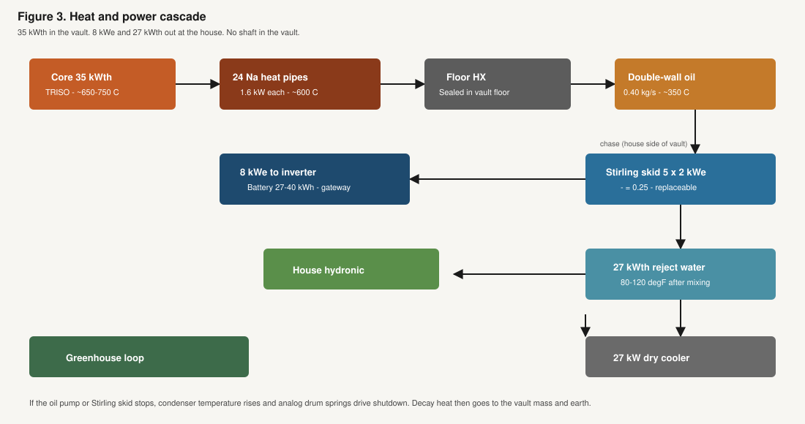
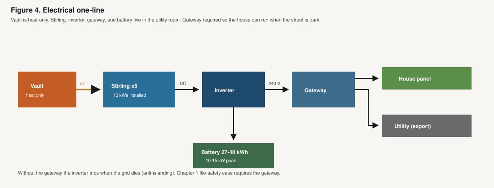

# The House

Chapter 3 is the yard. This chapter is how the Backyard Generating Station ties into the panel, the battery, the water heater, and, if you want it, a greenhouse. The vault stays sealed. Everything a plumber or an electrician would recognize happens in a **utility room** at the house end of a buried **chase** (the pipe-and-cable run from the underside of the vault). That room can be in the house or a small shed next to it.

---

## What arrives at the house

Pipes and cables leave through the **bottom** of the vault, bend in the dirt, and come up in the utility room. That is the same idea as a buried propane line or a sewer lateral, with one extra rule: there is no straight shot back to the lid. Chapter 3 explains why. Here, the point is only that people work at the house end, not in the hole.

Three things come out of that chase:

- **A closed heat loop.** Hot oil (or a similar heat fluid) in a double-wall pipe, cooler fluid back. This is not house water, and it never touches the core.
- **Power cables** from the heat-to-electricity engines in the utility room to an inverter and then to the electrical panel
- **A few status wires** so the inverter and the battery can see that the vault is running

The water in the house never mixes with anything inside the vault. Heat crosses a metal wall in an exchanger, the same way a boiler already hands warmth to a floor loop. If that exchanger ever leaked, you would get a service call in the utility room, not an open vault.

---

## Electricity: panel, inverter, battery

The electrical path is the one a solar-plus-battery job already uses.

There is **no steam turbine** and no spinning plant in the yard. Heat from the vault warms the hot end of a sealed **Stirling** engine in the utility room. A Stirling is a closed box with a hot side and a cool side. The temperature difference moves an internal piston and makes electricity. The same class of machine already runs on wellhead gas and in space tests. Five small units make the house’s 8 kW, with a spare. Each is about **12 inches across and 18 inches tall**, about **110 pounds**. Five of them, plus the oil pump and the heat exchanger, sit on a wall or a short rack next to the inverter. They fit a basement utility room or a small shed. They do not fit in a closet. They last on the order of **10 to 15 years** and get swapped in that room, the way a furnace is swapped. They do not live in the vault, because a century-sealed engine inside a buried box has not been shown. Chapter 2 puts the first set in the install check (**$40,000 to $100,000** today, **$15,000 to $30,000** as a factory target). The decade swap is a later check. It is not in the simple-payback tables.

The inverter turns that output into ordinary 120/240-volt house current and talks to the utility. When the battery is full and the house is satisfied, it exports. When the house wants more than the battery still holds, it buys a bit from the grid. Chapter 2 is the day-in-the-life. This chapter is the boxes in the utility room.

**The battery** sits in that room, not in the hole. Two or three wall units in the Tesla-class size (about 13 kWh each) cover the evening spike and a storm night. The vault fills them. They wear out on a decade-scale and get replaced, the same as they would on a solar job. That is owner maintenance. The vault is not.

**A backup switch (a gateway)** is required if you want the lights on when the street is dark. Ordinary inverters shut off when the grid dies, on purpose, so they do not feed a line a lineman thinks is dead. A gateway isolates the house, then lets the inverter and the battery (and the vault, still making heat) run the panel. Without that box, you have sell-back in good weather and a dark house in a blackout. Chapter 1’s life-safety case needs the gateway. Budget it as part of the same electrical job as the inverter.

The utility interconnection is a solar-class permit: an application, a meter that can run both ways, and rules about how much they will buy. The vault does not change that paperwork’s shape. It changes how many kilowatt-hours you have to sell.

---

## Heat: use it, or dump it on purpose

Chapter 2 listed what can take the water: radiant floors, a tank, a coil in the air handler, a boiler loop, an air-to-water heat pump, a greenhouse. The house-side hardware is ordinary hot-water heating work.

**If the house already has hot-water heat.** An isolated exchanger and a pair of pumps (on the house loop, not in the vault) drop in next to the boiler or the manifold. The old boiler stays as backup or peak. The thermostat you already have still calls for heat.

**If the house does not.** You still get electricity. Showers can take a standalone tank. Whole-house space heat means adding pipes, or sending the loop to a greenhouse, or skipping space heat and using the electricity only.

**August.** The vault is still making heat while it makes electricity. If the house only wants showers, the rest has to go somewhere on purpose:

- a greenhouse, if you built one
- a small outdoor radiator, the same kind of box a heat pump already uses on the side of a house
- do not leave unused heat to soak into the soil around the vault

If unused heat soaks into the soil, that patch of yard runs warmer. Place the radiator where a condenser already would go. How far the vault sits from the house is a permit question. Those are ordinary siting choices.

Frost on the buried loop is a normal plumbing problem: bury below the frost line, or insulate, or keep a trickle of flow. The chase already runs deep, under the ten feet of cover and over to the house.

---

## Water, flood, and the hole

The vault is built to sit wet. A lot of yards flood in a century. External water is extra shield and extra cooling. The inner vessel stays closed. It is built to live in a wet hole.

The utility-room boxes should sit **above** the flood you actually get, the same as a furnace or a panel should. Where the chase enters the foundation, it gets sealed the way any buried line into a basement gets sealed. Dirt washed off the lid is a Chapter 3 dose case. Water in the basement is a house case. Do not store the battery and the inverter in a pit that fills.

The buried object needs about a **10 by 10 foot** patch of yard. Setbacks from the house, a well, or the property line are the buried-tank kind the town already writes for septic or propane. The drawing says ten feet of soil above the lid. Keep a path a crane can use once at install and once at the swap (Chapter 7).

---

## What the crew does, in order

1. Permits: excavation, electrical, utility interconnection, and plumbing if there is a heat loop. Towns already know most of these as separate stamps.
2. Dig the hole. Bed it. Confirm groundwater and rock before the crane arrives.
3. Set the vault. Do not start it.
4. Run the underside chase to the utility room. Close the trench.
5. Land the Stirling units, inverter, gateway, battery, and (if used) the heat exchanger and radiator.
6. Backfill with **ten feet of soil** above the lid. A playset, if any, sits on that soil, on shallow footings or a pad. It is not bolted to the vault.
7. Inspectors sign the electrical and the burial.
8. A licensed startup (Chapter 5) is the first time the vault makes heat.

A first install on a new house can take days. That is a construction week. The homeowner’s job in that list is the same as a solar install plus a buried-tank job: be home for the meter, keep pets away from the work, and decide whether the heat loop is floors, a tank, a greenhouse, or a radiator.

---

## What fails, and what does not

On the house side, the wear items are the Stirling units, the oil pump, the battery, the inverter, a pump on the house heat loop, and the outdoor radiator fan. Those live in the utility room. They are replaceable without opening the vault. A Stirling set or an inverter swap is a decade-class job, in the same cost world as replacing a serious HVAC unit or a home generator, not a new vault. Chapter 2 is the first-set dollar band.

The vault has no owner-service moving parts. Heat inside it moves in sealed **heat pipes** (closed metal tubes, no pump). There is no turbine in the hole. If a heat pipe fails, that tube freezes in place and the others carry the load. If the oil loop in the chase leaks, the leak stays in the trench or the utility room. It does not open the core. If the utility-room engines stop, the vault overheats a little, the control drums spring shut, and leftover heat soaks into the box and the earth.

If the house is sold, the appliance stays with the lot the way a buried tank does, plus the utility-room equipment. Insurance and appraisal will have to treat that package as a normal house feature, the way they learned to treat solar. Until they do, it is a new line on a policy and a new note on an appraisal.

---

## What this chapter covered

This is the house chapter: a buried chase to a utility room, solar-class inverter and sell-back, a gateway so the house can stay on in a blackout, heat the house already uses or a greenhouse or a radiator, and a vault that can sit wet while the batteries stay dry. Chapter 5 is what is inside the vault. Chapter 6 is who lets you set it. The utility-room work should look familiar to a solar electrician or a boiler technician.
