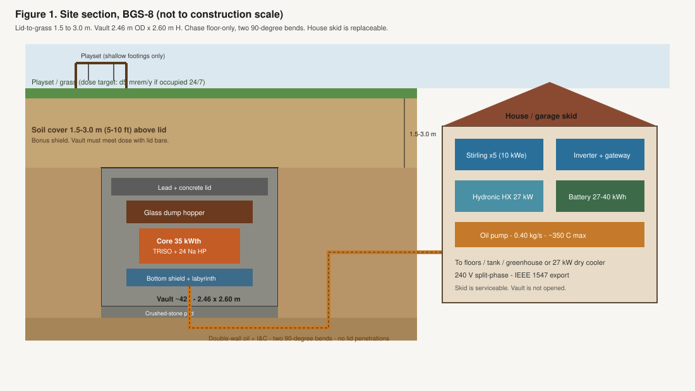
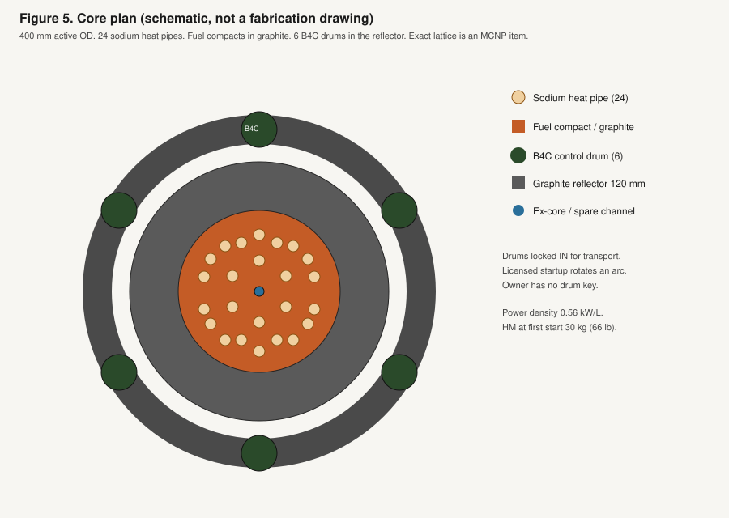
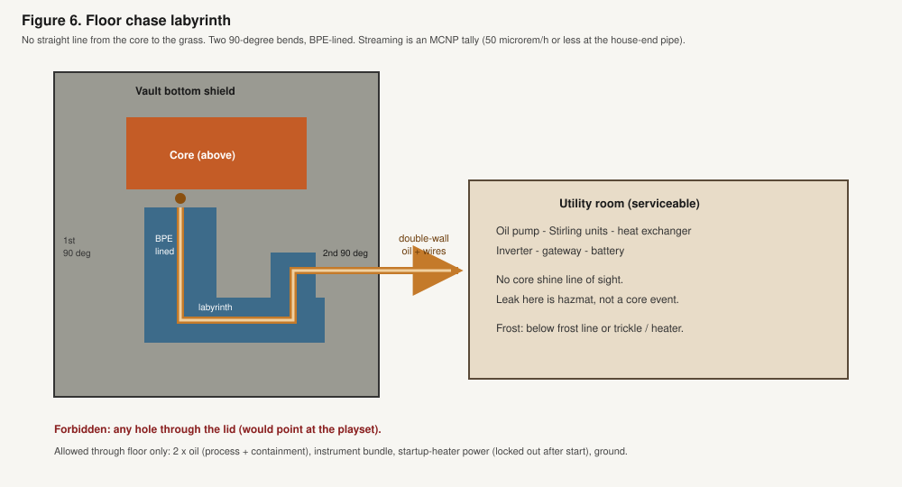
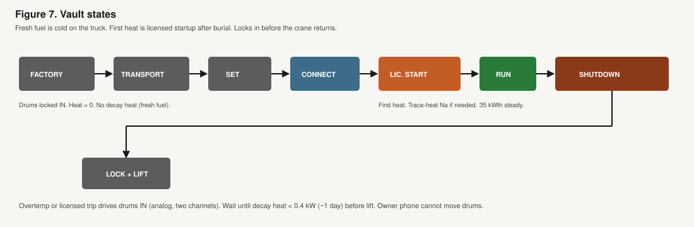
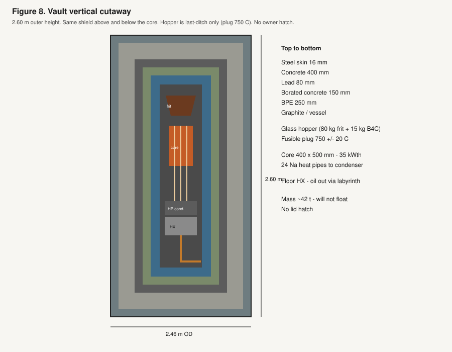

# 8. Vault and core design specification

**Chapters:** [1. The Need](1_The-Need.md) · [2. The Idea](2_The-Idea.md) · [3. Yard Safety](3_Yard-Safety.md) · [4. The House](4_The-House.md) · [5. The Vault](5_The-Vault.md) · [6. The Approval](6_The-Approval.md) · [7. The Swap](7_The-Swap.md) · **8. Vault Spec** · [9. The Fuel](9_The-Fuel.md) · [10. The Proofs](10_The-Proofs.md)

← [Previous: 7. The Swap](7_The-Swap.md) · [Start](README.md) · [Whole book as a PDF](Backyard-1.6.pdf) · **Next:** [9. The Fuel](9_The-Fuel.md) →

---

**Document type:** Preliminary design basis (not a licensed safety analysis).  
**Unit:** Backyard Generating Station, type **BGS-8**. The 8 is the electrical size (8 kWe), not “the eighth try.” This is the first type unit. Family band is 5 to 10 kWe.  
**Audience:** Mechanical, nuclear, shielding, and electrical engineers. Chapter 5 is the homeowner story of the vault. Chapter 9 is the fuel, the core, sodium in the heat pipes, first principles, and the contrast with water plants and sodium fast reactors. Chapter 10 is the proof plan: which claims are closed arithmetic, which are handbook bounds, and which still need codes, tests, or a stamp. This file is what you size, buy, and analyze.

In one paragraph: a sealed heat source in a septic-tank vault, **3.0 m (10 ft) of soil above the lid**, heat pipes to a double-wall oil chase, electricity made in the **utility room** by replaceable Stirling engines. The vault is the shield. Dirt is bonus. Dose is designed with the lid bare. The core kit (TRISO, heat pipes, drums, Stirling) is a known class of hardware, licensed or built from that class, not a new reaction.

An engineer can use this to start a sign-off package. They cannot stamp the vault from this file alone. Required follow-on work is listed in §16. Chapter 10 restates each claim as a proof item (Closed, Bound, or Open) and names the spec or test. Numbers below are closed arithmetic or standard handbook values. Where a transport code (**MCNP**, Monte Carlo N-Particle: the standard program that tracks neutrons and gammas through the shield to predict dose), SCALE, or an ASME stress report is mandatory, the spec says so and gives the requirement the code run must meet. Do not invent a k-effective in this file or in Chapter 10.

No owner hatch. No in-vault service pumps. Power conversion that wears is on the house side of the chase. The vault is a sealed heat source.

---

## 1. Design basis (shall)

| ID | Requirement |
| --- | --- |
| DB-1 | Continuous electrical output **8.0 kWe** net at the inverter DC bus, product family **5 to 10 kWe**. |
| DB-2 | Core thermal power **35 kWth** nominal (32 kWth at 25% conversion plus 10% margin). Family band 20 to 40 kWth. |
| DB-3 | Sealed operating life **100 years** at ≥90% capacity factor without opening the vault. |
| DB-4 | Heat and electricity are both products. Reject heat from conversion is **80 to 120°F** hydronic water (27 to 49°C) for the house, or a greenhouse, or a dedicated dry cooler. |
| DB-5 | Extra dose at the grass, dry soil, vault running: **≤5 mrem/year** if a person occupied that spot 8,760 h/y. Playset at 1 h/d is then ~0.2 mrem/y (Chapter 3). |
| DB-6 | Same 5 mrem/y target with the **lid bare** (scour / 2 ft of soil gone). Soil is bonus, not the shield. |
| DB-7 | Penetrations **floor only**, then a bent chase. No lid penetrations. |
| DB-8 | Vault sits **flooded**. External water is allowed. Inner boundary remains leak-tight. |
| DB-9 | Factory assembled **subcritical, shutdown locks in**. First heat only after burial and licensed startup. Locks in before crane-out. |
| DB-10 | No vault-side pump required for core cooling or shutdown decay heat. |
| DB-11 | Excess reactivity after shutdown margin shall be **under 0.8 dollars** so a single failure cannot make the core prompt-critical. |
| DB-12 | Last-ditch borosilicate + B₄C dump, fusible, no power required. Not credited for normal operation. |
| DB-13 | All in-vault materials are items a US nuclear or ASME shop can buy or already fabricates. No exotic materials. |

---

## 2. Power and energy (closed arithmetic)

### 2.1 Why 35 kWth

House-side conversion baseline is free-piston Stirling, **η = 0.25** (hot end ~350 to 600°C, cold end ~40 to 50°C). Demonstrated class: NASA KRUSTY / Sunpower-style convertors; commercial wellhead units (Qnergy class) exist at several kWe.

```
P_th = P_e / η = 8.0 kWe / 0.25 = 32.0 kWth
P_th,spec = 32.0 × 1.10 = 35.2 kWth  →  specify 35 kWth
P_reject = 35 − 8 = 27 kWth
```

27 kWth is a mid-size house heating load (typical winter 5 to 15 kW) plus domestic hot water, with margin, or a greenhouse, or a ~10-ton-class dry cooler in summer (1 refrigeration ton ≈ 3.5 kW).

If conversion is only thermoelectric at η = 0.08, the same 8 kWe needs **100 kWth**. That is a different, larger vault. It is the alternate in §6.3. Baseline is 35 kWth.

### 2.2 Annual electricity

```
8.0 kW × 8,760 h/y = 70,080 kWh/y
at 90% CF: 8.0 × 8,760 × 0.90 = 63,072 kWh/y
```

Typical house 11,000 kWh/y → export ~52,000 to 59,000 kWh/y.  
High-use house 25,000 to 35,000 kWh/y → export ~28,000 to 45,000 kWh/y.  
Average house load 1.1 to 4 kW. 8 kWe covers both. Peaks 10 to 20 kW are the battery (Chapter 4).

### 2.3 100-year thermal energy and burnup

```
E = 35 kW × 8,760 h/y × 100 y = 30,660,000 kWh
  = 30,660 MWh

P = 0.035 MW
E = 0.035 MW × 365.25 d/y × 100 y = 1,278.4 MWd
```

Heavy-metal mass from burnup B (MWd per tonne):

```
m_burned (t) = 1,278.4 / B
```

| Assumed discharge burnup | Burned HM | Notes |
| --- | --- | --- |
| 50 GWd/t (50,000 MWd/t) | 25.6 kg | Conservative UO₂-class |
| 80 GWd/t | 16.0 kg | TRISO-UCO, realistic target |
| 100 GWd/t | 12.8 kg | Aggressive TRISO |

**Inventory at first start is larger than mass consumed** (need leftover fissile at year 100, burnable poison, and a critical geometry). Specify:

| Item | Value |
| --- | --- |
| Heavy metal at first start | **30 kg (66 lb)** |
| Consumed HM at 80 GWd/t, end of life | 16 kg (35 lb) |
| Residual HM at end of life | ~14 kg in the same compacts |

Layman Chapter 5’s older “~10 kg” was order-of-magnitude at a lower thermal power. This spec supersedes it for engineering.

### 2.4 Fission rate and U-235 consumed

Energy per fission: 200 MeV = 200 × 1.602×10⁻¹³ J = **3.204×10⁻¹¹ J**.

```
R_f = 35,000 J/s  /  3.204×10⁻¹¹ J = 1.092×10¹⁵ fissions/s
```

Per year (365.25 d):

```
N_y = 1.092×10¹⁵ × 3.15576×10⁷ = 3.447×10²² fissions/y
m_U235 = 3.447×10²² / 6.022×10²³ × 235 g = 13.45 g/y
100 y → 1.35 kg U-235-equivalent fissioned
```

Some fissions at mid-life are Pu-239. The 1.35 kg is fission-equivalent, not a claim that only U-235 fissions.

Initial U-235 in 30 kg of 19.75 wt% U:

```
0.1975 × 30 kg = 5.93 kg U-235
```

Burning 1.35 kg-eq leaves several kg fissile plus bred Pu. End-of-life criticality is a SCALE/ORIGEN depletion problem (§16). It is not a fuel-shortage problem.

### 2.5 Decay heat (shutdown)

Way / ANS-style: P/P₀ ≈ 0.066 t⁻⁰·² (t in seconds, infinite prior operation, good enough for sizing).

| Time after shutdown | t (s) | t⁻⁰·² | P/P₀ | P (kW) | Household analog |
| --- | --- | --- | --- | --- | --- |
| 1 s | 1 | 1.000 | 0.066 | 2.31 | Large space heater |
| 1 h | 3,600 | 0.194 | 0.0128 | 0.45 | Small space heater |
| 1 d | 86,400 | 0.103 | 0.0068 | 0.24 | Heat lamp |
| 7 d | 6.05×10⁵ | 0.0697 | 0.0046 | 0.16 | Night-light class, thermal |

**DB-10 is satisfied:** after trip, the vault mass (~42 t, §9) and earth reject <1 kW without a pump. No tower.

Crude earth conduction, treat vault as a sphere r = 1.4 m, soil k = 1.0 W/m·K, Q = 0.5 kW:

```
ΔT = Q / (4 π k r) = 500 / (4 × 3.1416 × 1.0 × 1.4) = 28 K
```

Soil far-field plus 28°C at the wall after a few hours. Acceptable. **Do not use this formula for operating 35 kW.** Operating heat is extracted by heat pipes. If 35 kW were dumped to soil: ΔT ≈ 1,990 K, which is why August heat must go to a dry cooler or a greenhouse (Chapter 4), not into the dirt.

---

## 3. Core

In plain language: the core is a beer-keg-sized graphite block full of coated uranium particles (TRISO), not a pool of water and not a bundle of bare rods. About 20% of the uranium is U-235. Sodium sits only inside sealed heat pipes. There is no water in the core and nothing that can “boil dry.” Heat pipes fail by freezing in place. Chapter 9 is that machine in English: fuel, graphite, sodium in the pipes, and how the reaction is meant to stop.

### 3.1 Type (baseline)

**Heat-pipe microreactor, TRISO-UCO fuel, graphite moderator/reflector, sodium heat pipes.**

Heritage: NASA KRUSTY (heat pipes + Stirling), Westinghouse eVinci (heat-pipe microreactor), X-energy / BWXT TRISO. All components exist in some form. This product would license or build from that class. This unit is smaller than eVinci (that is MWt-class) and longer-lived than KRUSTY (that was a short ground test). It is built from that class of hardware, not a copy of either machine.

**Why TRISO, not UZrH, as baseline:** TRIGA UZrH has a stronger prompt negative coefficient (good). Hydrogen migration and hydride stability over 100 years are not a signed-off materials program. TRISO-UCO in graphite is the US path that already has a fuel fabrication line. Prompt feedback is Doppler in the kernel (negative, weaker than UZrH). Safety then also depends on **DB-11** (little excess reactivity) plus the glass dump.

Alternate (if a materials program qualifies it): UZrH-LEU 19.75% rods, TRIGA geometry. Same vault, different core cartridge. Note as Option C-2, not baseline.

### 3.2 Fuel specification

| Parameter | Spec | Why it is buyable |
| --- | --- | --- |
| Kernel | UCO, 19.75 ± 0.20 wt% U-235 | Standard US research / HALEU assay. Not HEU. |
| Particle | TRISO: IPyC / SiC / OPyC on kernel | BWXT / X-energy class process |
| Compact | Cylindrical graphite compact, TRISO packed ~35 vol% | Prismatic microreactor practice |
| HM at first start | 30 kg (66 lb) | §2.3 |
| Burnable poison | Er₂O₃ or Gd₂O₃ integral in compact or as discrete rods | Standard PWR/microreactor practice |
| Design burnup | 80 GWd/t peak compact, 100 GWd/t not required | TRISO has been taken past this in AGR/HTGR tests |
| Fission-gas | Held in TRISO buffer; no vented fuel | Required for a sealed vault |

Enrichment stays **below 20%** so the material is HALEU, not HEU. That is a security and policy choice as well as a physics choice.

### 3.3 Geometry (type unit)

```
Active core:     400 mm diameter × 500 mm height
Core volume:     π × 0.20² × 0.50 = 0.0628 m³ = 62.8 L
Power density:   35 kW / 62.8 L = 0.56 kW/L = 0.56 MW/m³
```

A PWR is ~100 MW/m³. This core is ~200× less dense. That is the 100-year fluence trick.

```
HM loading: 30 kg / 62.8 L = 0.48 g/cm³
```

TRISO compacts routinely hold 0.5 to 1.0 g/cm³ HM. 0.48 is not cramped.

**Heat-pipe lattice (plan):** 24 sodium heat pipes, 22 mm OD, on a triangular pitch through the graphite, plus ~80 to 120 fuel compact channels. Exact lattice is an MCNP/SCALE item. Pipe count from §4.1.

**Reflector:** 120 mm radial and axial graphite (or BeO if a later run needs a smaller core; graphite is cheaper and fully supply-chain). Outer reflector diameter 400 + 2×120 = **640 mm**. Beer-keg to dishwasher, as Chapter 5 said.

**Inner vessel:** SS316L, 12 mm wall, ~700 mm OD, helium or low-pressure inert fill around the graphite. Not a PWR pressure boundary. Design pressure **≤ 0.5 MPa** (gas plus heat-pipe fail-in-place). ASME VIII or III as the QA program dictates.

### 3.4 Neutronics requirements (analysis, not a fake k_eff)

The following are **acceptance criteria** for the lattice model. Do not invent a k_eff in this file.

| State | Criterion |
| --- | --- |
| Cold, clean, drums in (factory / truck) | k_eff ≤ 0.95, including 3σ and tolerances |
| Hot, xenon eq., drums at power, BOL | 1.000 ≤ k_eff ≤ 1.005, drums not on a stop |
| Hot, EOL, poisons depleted | k_eff ≥ 1.000 with drums at max worth remaining |
| Most reactive drum stuck out, others in | k_eff ≤ 0.99 |
| All drums out, cold, clean (beyond design) | Still < prompt critical; DB-11 |
| Flooded inner vessel (water ingress) | k_eff **decreases** or stays subcritical (void / spectrum shall be analyzed both ways) |

Drum / rod worth: **B₄C control drums** in the reflector (eVinci / Kilopower style), 6 drums. Shutdown margin at least 1.0 dollar with most reactive drum stuck withdrawn. Mechanical locks pin drums in the in (absorbing) position for transport. Licensed startup is a keyed, two-person rotation to the operating arc. The owner key does not exist.

Burnable poison designed so drum motion over 100 years is slow (a few degrees per decade), not weekly.

### 3.5 Fluence (order of magnitude)

Fission density:

```
1.092×10¹⁵ /s  /  6.28×10⁴ cm³  = 1.74×10¹⁰ fissions/cm³·s
```

If macroscopic fission cross section Σ_f ~ 0.08 to 0.15 cm⁻¹ (to be taken from the lattice), thermal flux is:

```
φ ~ (1.74×10¹⁰) / Σ_f  ≈ 1×10¹¹ to 2×10¹¹ n/cm²·s
```

```
t_100y = 3.15576×10⁹ s
Φ ~ 3×10²⁰ to 7×10²⁰ n/cm²
```

That is research-reactor cladding fluence, not a 40-year PWR barrel. SS316L, graphite, and TRISO SiC are in a plausible range. **dpa and graphite shrinkage still need a materials assessment** (§16). This is why power density was kept low on purpose.

---

## 4. Heat transport (in the vault: no pumps)

In plain language: sodium stays inside 24 sealed heat pipes. Those pipes hand heat to a sealed exchanger in the vault floor. Double-wall oil carries that heat through the buried chase to the utility room. House water never enters the vault. An oil leak is a trench or room cleanup. A sodium leak stays in that pipe and freezes. If the utility-room engines stop, drums spring in and leftover heat goes to the 42 t box and the earth.

### 4.1 Sodium heat pipes

| Parameter | Spec |
| --- | --- |
| Working fluid | Sodium, ASTM / nuclear grade |
| Count | 24 operating + 4 spare channels (plugged spares) |
| Rating | 1.6 kW each at 600°C vapor |
| 24 × 1.6 | 38.4 kW > 35 kWth |
| Envelope | SS316L or Haynes 230, 22 mm OD, ~1.8 m long |
| Wick | Sintered or annular-gap, space/heat-pipe vendor practice (ACT, Thermacore class) |
| Freeze | Na melts at 98°C. Startup from a cold truck uses trace heaters on the condenser block (powered from the house during licensed startup only) **or** a NaK subset (3 pipes) that are liquid at room temp to bootstrap |
| Fail-in-place | One pipe fail: 23 × 1.6 = 36.8 kW, still above 35. Two fail: 35.2 kW. Three fail: derate electrical output. |
| Walls | Single sealed envelope. Second barrier is the inner vessel (inert fill). Not a double-wall heat pipe. The oil chase is the double-wall loop, because it leaves the vault. |
| Design life | 100 y sealed, same as the vault. Qualification at that life is a §16 item. Fail-in-place plus spares is the operational safety net. |

Kilopower/KRUSTY ran sodium heat pipes on a real critical core. This is the most manufacturable high-T, no-pump choice.

### 4.2 Temperature cascade (CHP)

Heat steps down, on purpose, from the fuel to the house. Each row is cooler than the one above it.

| Where | About how hot | Why |
| --- | --- | --- |
| Fuel compact | 650 to 750°C | TRISO ceramic is fine well above this |
| Heat-pipe vapor | ~600°C | Sodium vapor inside the sealed pipes |
| Primary exchanger | ~550°C metal | Vault floor, still inside the box |
| Oil loop in the chase | ~350°C | Double-wall; or 500°C if a later NaK loop |
| Stirling hot end (utility room) | 300 to 500°C | Replaceable engines, not in the vault |
| Stirling cool end | 40 to 50°C water | The leftover heat product |
| House heat loop | 80 to 120°F (27 to 49°C) | After a mixing valve, floor and tank range |

A perfect heat engine between those Stirling temperatures (about 600 K hot, 320 K cold) could turn at most about 47% of the heat into electricity. That ceiling is called Carnot. A real Stirling at 25% is about half of that ceiling. That is a normal real engine, not a calculation error.

### 4.3 Secondary loop (vault floor → chase → house)

**Baseline fluid:** Dowtherm A or equivalent, double-wall, leak-detected annulus, buried. Max bulk 350°C, well inside the oil’s 400°C rating. Industrial solar-thermal / process shops already weld this.

```
Q = 35 kW
c_p ≈ 2.2 kJ/kg·K
ΔT = 40 K
m = Q / (c_p ΔT) = 35 / (2.2 × 40) = 0.40 kg/s  ≈ 6 to 7 gpm
```

Pipe: 25 mm (1 in) inner process + 40 mm containment. Two pipes (hot/return) in the chase. Circulation pump is **in the utility room**, not in the vault. Vault-side flow through the primary HX is driven by the heat pipes (vapor to condenser). The oil loop can sit still during shutdown; decay heat does not need it.

**Primary HX:** printed-circuit or helical-coil SS316L, bolted in a sealed floor compartment of the vault, welded closed at the factory. Oil in, oil out, through the floor only.

**Leak:** oil stays in the chase / house. It never becomes a core LOCA. Na stays in the heat pipes. A pipe fail freezes sodium in place.

**Alternate secondary:** NaK (liquid at room temp, better heat transfer, water-reactive). Only if the oil loop’s 350°C cap hurts Stirling efficiency. Then an extra isolation HX before any water.

### 4.4 House reject and summer

27 kWth to:

- hydronic HX (plate, stainless, isolated from potable), or
- greenhouse loop, or
- dry cooler: **27 kW** air coil, ~10-ton HVAC condenser class, COTS (Modine / Guntner / any chiller reject).

If the oil pump stops and Stirlings stop, 35 kW has nowhere to go except the vault and soil. **Overtemp on the condenser block rotates drums in** (analog, spring or gravity, two channels). Core goes to decay heat. That is the protected fault for “utility room offline.”

---

## 5. Power conversion (utility room, replaceable)

In plain language: the vault is a sealed heater. Electricity is made in the utility room. A 100-year sealed Stirling inside the vault is not a demonstrated part. Demonstrated engine life is a decade, not a century. So the engines sit where a furnace sits, and they get swapped there.

**The vault has no shaft.** Conversion is Chapter 4 equipment.

| Item | Spec |
| --- | --- |
| Convertors | 5 × 2.0 kWe hermetic free-piston Stirling (10 kWe installed) |
| Envelope | ~300 mm OD × 450 mm H, ~50 kg each (Microgen 1–2 kWe class). Five plus oil HX and pump fit a utility room, not a closet. |
| First-cost class | $8k to $20k per unit today; $3k to $6k factory target. Set: $40k to $100k today, $15k to $30k factory (Chapter 2). |
| Dispatch | 4 of 5 for 8 kWe; 1 spare online or rotating |
| Life | 10 to 15 years each; swap on the wall, vault stays closed. Decade swap is not in Chapter 2 simple payback. |
| Output | 200 to 400 VDC → hybrid inverter (IEEE 1547 / UL 1741) |
| Gateway | Required for islanding (Chapter 4). Without it the house goes dark when the utility does. |
| Battery | 2 to 3 × 13.5 kWh (27 to 40 kWh), 10 to 15 kW peak |

**Alternate 6.3, no moving parts:** utility room is a thermoelectric array. η ≈ 0.08 → core must be **100 kWth**, fuel and shield grow (~2.9× burnup, larger vault). Use only if a customer forbids a Stirling set.

---

## 6. Shielding and dose

In plain language: the vault, not the dirt, is the shield. Ten feet of soil is the yard you see and extra attenuation. The live-on-the-grass number (≤5 mrem/y) must still hold with the lid bare and the soil dry. A playset at one hour a day is then about 0.2 mrem/y. MCNP (defined in the header) has to confirm the stack. Until that run exists, 5 mrem/y is a requirement, not a measured result.

### 6.1 Sources (running, 35 kWth)

```
Neutrons: ~2.4 n/fission × 1.092×10¹⁵ = 2.62×10¹⁵ n/s
Gamma energy (prompt ~7 MeV/fission):
  7×10⁶ × 1.602×10⁻¹⁹ × 1.092×10¹⁵ = 1.22 kW gamma
```

Plus capture gammas in the shield (especially 2.2 MeV from H, and Fe if any). Capture gamma is why lead sits **outside** the hydrogenous layer.

Unshielded neutron flux at 2 m:

```
Φ = S / (4 π r²) = 2.62×10¹⁵ / (4 π × 4×10⁴ cm²) = 5.2×10⁹ n/cm²·s
```

That is immediately unsurvivable. The shield is not optional.

### 6.2 Target dose rates

| Location | Running | Shutdown (1 d) |
| --- | --- | --- |
| Grass, 3.0 m (10 ft) soil above lid, dry soil | ≤ 0.57 µrem/h (→ 5 mrem/8,760 h) | ≪ running |
| Lid outer surface, **no soil** (scour) | ≤ 0.57 µrem/h | same target |
| Side of buried vault, in soil, 1 m from wall | ≤ 5 µrem/h (occupational not applicable; this is dirt) | — |
| House chase, after two bends | ≤ 50 µrem/h contact on the pipe chase (worker, short time) | — |

0.57 µrem/h is ~5% of a typical 10 µR/h backyard background. A meter may not see it.

### 6.3 Layer stack (radial, type unit)

Inside to outside:

| Layer | Thickness | Outer diameter | Function |
| --- | --- | --- | --- |
| Core | 200 mm radius | 400 mm | Fuel + heat pipes |
| Graphite reflector | 120 mm | 640 mm | Neutrons back, some shield |
| SS inner vessel | 12 mm | 664 mm | Seal, not the gamma wall |
| Borated polyethylene (BPE, 5 wt% B) | 250 mm | 1,164 mm | Slow and eat neutrons |
| Borated concrete (2 wt% B) | 150 mm | 1,464 mm | Neutrons + some gamma |
| Lead (ASTM B29) | 80 mm | 1,624 mm | Gamma, including capture |
| Reinforced concrete | 400 mm | 2,424 mm | Gamma, structure, missile |
| Steel outer shell | 16 mm | 2,456 mm | Skin, lift lugs, waterproof |

**Outer diameter ≈ 2.46 m (8.1 ft). Outer height ≈ 2.60 m (8.5 ft).** Large septic / small cask. Not a campus.

Axial: same water-equivalent above and below the core, plus a 250 mm glass-dump hopper **above** the core, still inside the vessel, still under the top shield. Floor chase leaves through the bottom biological shield in an offset steel labyrinth (two 90° turns, 200 mm BPE lining).

### 6.4 Attenuation (handbook, not a substitute for MCNP)

Tenth-value layers (TVL), approximate, fission spectrum / ~1 to 2 MeV gamma:

| Material | TVL neutrons (fission) | TVL gamma (~1.5 MeV) |
| --- | --- | --- |
| BPE | ~12 to 15 cm | poor (use lead) |
| Concrete | ~20 to 28 cm | ~20 to 24 cm |
| Lead | poor | ~4.0 to 4.5 cm |
| Dry soil | worse than wet by ~1.5 to 2× for n | ~25 to 35 cm |
| Wet soil | closer to concrete for n | ~20 to 30 cm |

Neutron path (radial): 25 cm BPE (~1.8 TVL) + 15 cm borated concrete (~0.6 TVL) + 40 cm concrete (~1.6 TVL) ≈ **4 TVL ≈ 10⁴** before soil. Dry-soil bonus is then extra. **Not enough alone** for 10⁸ to 10⁹. The reflector, BPE boron capture, and the fact that the core is small (1/r² and self-shielding) have to be in the transport model. **Preliminary stack is sized to give MCNP a geometry that can meet DB-5 and DB-6. If it misses, add BPE or lead, do not add “more dirt” as the fix.**

Gamma path: 8 cm lead ≈ 1.8 TVL (×63) plus 40 cm concrete ≈ 1.8 TVL (×63) ≈ **×4,000** plus soil. Capture gammas born in the BPE are what the lead is for. Order the layers as drawn. Do not put lead inside the BPE.

**Sign-off run:** MCNP6 or equivalent, running and shutdown, dry sand (5 wt% water) and wet (15 wt%), lid buried and lid bare, chase streaming, skyshine with lid bare. Until that run exists, DB-5 is a requirement, not a demonstrated number.

### 6.5 Playset (from Chapter 3, numbers)

```
5 mrem/y × (365 h / 8,760 h) = 0.21 mrem/y at 1 h/d
Coast-to-coast flight ≈ 3 to 5 mrem
Playset year ≈ 1/15 to 1/25 of one flight
```

---

## 7. Passive safety

### 7.1 Normal

- Low power density, heat pipes, no pump.
- House load steps are the battery. Core is steady.
- Doppler in UCO kernels: negative. Graphite: slight positive moderator temp in some lattices; **the lattice shall be designed so the net power coefficient is negative** from 20°C to 750°C. That is a hard SCALE/MCNP criterion.

### 7.2 Anticipated faults

| Fault | Response |
| --- | --- |
| Oil pump off / Stirling off | Condenser T rises. Analog bi-metal or fusible link releases drum springs **in**. Decay heat to earth. |
| One or two heat pipes dead | Margin in §4.1. |
| Grid loss | Gateway islands. Vault does not care. |
| Chase shear (excavator) | Double-wall oil spill is a hazmat event, not a core event. Drums in on overtemp. |
| Flood | External water: more shield, more cooling. Inner vessel designed not to flood. If it does, k_eff criterion in §3.4. |
| Dry soil / drought | Shield still meets DB-5 without wet dirt. |
| Scour to lid | DB-6. |

### 7.3 Glass dump (last ditch, not credited in the licensing basis until tested)

| Item | Spec |
| --- | --- |
| Mass | 80 kg borosilicate frit + 15 kg B₄C powder |
| Hold-up | Hopper above core, 304 SS, fusible plug |
| Plug | Au-Ge or Al-Si eutectic, melt **750 ± 20°C** (above normal HP 600°C, below vessel limits) |
| Action | Gravity pour into core channels, boron kills reactivity, glass wets and sets |
| Power | None |
| Expected use | Once in never. Qualification: furnace test on a dummy lattice. |

### 7.4 Why a “runaway” is not a plant-scale event

```
Stored energy in 35 kW for 10 s = 350 kJ  (one-tenth of a kWh)
```

A prompt jump that self-limits in milliseconds dumps a small energy into a large graphite/steel mass. There is no 3 GWth inventory. Decay heat is a space heater. That is the size argument in Chapter 6, in numbers.

---

## 8. Mechanical envelope, mass, soil, flood

### 8.1 Mass build (type unit)

| Item | Volume or note | Mass |
| --- | --- | --- |
| Concrete (shield + structure) | ~10.5 m³ × 2,400 kg/m³ | 25,200 kg |
| Lead | ~1.05 m³ × 11,340 kg/m³ | 11,900 kg |
| BPE | ~0.85 m³ × 940 kg/m³ | 800 kg |
| Steel shells, vessel, lugs | — | 2,800 kg |
| Graphite + TRISO + Na + drums | — | 1,400 kg |
| **Total** | | **~42,100 kg (92,800 lb, 46.4 short tons)** |

Lead volume check: cylindrical shell ID 1.464 m, t = 0.08 m, h = 1.80 m:

```
V_wall = π h (R² − r²) = 3.1416 × 1.80 × (0.812² − 0.732²) = 0.70 m³
V_ends ≈ 2 × π × 0.77² × 0.08 = 0.30 m³
V_Pb ≈ 1.00 m³  (table uses 1.05 with laps)
```

Concrete: outer cylinder 2.42 m OD, 2.60 m tall, minus inner cavity ~1.62 m, plus extra in the floor labyrinth. 10.5 m³ is a rounded shop number; the civil drawing shall close the takeoff.

### 8.2 Soil bearing and buoyancy

Footprint ≈ π × 1.23² = 4.75 m².

```
q = 42,100 kg × 9.81 N/kg / 4.75 m² = 87 kPa ≈ 1.8 ksf
```

Most residential soils are 1.5 to 3 ksf allowable. Spec a **200 mm compacted crushed-stone pad**. If the geotech says no, a thin concrete mat. Not a pile foundation.

Displaced volume ≈ π × 1.23² × 2.60 = 12.3 m³. Buoyant force in full flood:

```
12.3 m³ × 1,000 kg/m³ = 12.3 t  <<  42 t
```

The vault **does not float**. No hold-down straps required for buoyancy. Still grout the pad so it does not walk in a scour hole.

### 8.3 Lift and transport

- Four trunnions on the steel shell, 2 × 25 t WLL each, redundant pair.
- Highway: overweight / overwidth permit, lowboy. 2.46 m wide is legal in most states with a permit (8.5 ft wide is the usual unpermitted cap; this is ~8.1 ft **body**; add 6 in lugs and you need a permit). Height on a 0.5 m deck ≈ 3.1 m, OK.
- Crane: 80 to 100 t class at 6 to 8 m radius (ordinary house-move / septic crane).
- Package: analyze as a **Type B** transport (10 CFR 71) for the fueled vault. That is a real cost and a real test (drop, fire, immersion). Do not skip it.

### 8.4 Lid-to-grass

**3.0 m (10 ft) of backfill above the lid.** Dose still designed to DB-5 / DB-6 with the lid bare. Soil is bonus. Vault height 2.60 m + 3.0 m cover → excavation ~5.6 m (about 18.5 ft) to the pad. That is a deep buried-tank hole, shored, in the same class as a large underground fuel tank or cistern, not a shallow septic lid. Grass footprint of the object is about **10 × 10 ft**. Setbacks from the house are a local buried-tank permit, not this spec.

---

## 9. Penetrations and chase

```
          GRASS / PLAYSET
         ================
              3.0 m (10 ft) soil
         +------------------+
         |   top shield     |
         |   glass hopper   |
         |   core + HPs     |
         |   bottom shield  |
         |    \  labyrinth  |
         +-----\------+-----+
                \     |
                 \    |  two 90° bends, BPE lined
                  \   |
                   ===|===  double-wall oil + instrument + ground
                      |
                      +--> utility room (Stirling, pump, hydronic, inverter)
```

**Through the floor only:**

- 2 × thermal-oil process + containment
- 1 × instrument bundle (MI cable, Class 1E-equivalent for drum trip)
- 1 × startup heater power (used once, then locked out)
- 1 × ground

No air intake. No stack. No lid penetration. Streaming: each line offset so there is no straight line from the core to the grass. Acceptance: MCNP chase model ≤ 50 µrem/h on the house-end pipe.

Frost: bury below local frost line or heat-trace the oil (oil is already hot when running; shutdown in a Minnesota January needs freeze protection on the oil, pour-point of Dowtherm A is fine, viscosity is the issue). House pump and a small trickle or a tank heater.

---

## 10. I&C and states

### 10.1 States

```
FACTORY_SHUTDOWN  →  (seal)  →  TRANSPORT  →  SET  →  CONNECT
    →  INSPECT  →  LICENSED_START  →  RUN  →  (overtemp | command)
    →  SHUTDOWN  →  COOL  →  LICENSED_LOCK  →  LIFT
```

| State | Drums | Heat | Oil pump | Notes |
| --- | --- | --- | --- | --- |
| Factory / transport / set | Locked in | 0 | off | Fresh fuel, no decay heat |
| Licensed start | Stepped out | rising | on | Trace heat on Na if needed |
| Run | Fine arc | 35 kWth | on | Owner cannot move drums |
| Shutdown | In | decay | off | Analog trip or licensed |
| Lift | Locked in | decay only | off | Wait until P_decay < 0.4 kW (~1 d) |

### 10.2 Trip (analog, two channels, no phone)

- Condenser / HP vapor T high
- Drum position disagree
- Seismic switch (optional, cheap)
- Manual licensed trip at the house panel (key, not an app)

App / inverter: status only (Chapter 2). Not a drum control. Not a storm mode.

### 10.3 Instruments (ex-core)

- 2 × fission chambers or Compensated ion chambers in the reflector (startup + run)
- 6 × Type K or N thermocouples on heat-pipe condensers
- Oil T and flow at the HX
- He / moisture in the inner vessel
- Lead-door / seal wires (IAEA-style) for tamper

---

## 11. Environments

| Load | Spec |
| --- | --- |
| Flood | Full immersion, indefinite. IP68 / submarine weld on outer shell. |
| Dry sand | Shield analysis at 5 wt% water. |
| Design soil T | −20 to 40°C far field |
| Seismic | ASCE 43 or IBC site class D, 0.3 g, vault as a rigid box on a pad. No in-core mechanisms except drums (latched). |
| Tornado / missile | Buried. Lid under 3.0 m soil. Bare-lid case is flood/scour, not a missile. |
| Fire (transport) | 10 CFR 71 800°C / 30 min. Glass dump may fire; that is acceptable if k_eff stays down. |
| Design basis excavation | Assume a backhoe can hit the shell. Contact dose on bare shell still a **worker** number, not a playset number. Keep it low enough for a 1-hour unplanned exposure < 100 mrem. That is another MCNP tally. |

---

## 12. Materials and manufacturing (all real parts)

| Part | Material / spec | Who already makes this class of thing |
| --- | --- | --- |
| TRISO-UCO | 19.75% U, ASTM / NRC fuel QAP | BWXT, X-energy line |
| Graphite | Nuclear grade (NBG-18 or equivalent) | GrafTech / Toyo Tanso class |
| Heat pipes | SS316L or Haynes 230, Na | ACT, Thermacore, space vendors |
| Inner vessel | SS316L, ASME IX weld, He leak ≤ 1×10⁻⁸ mbar·L/s | Any N-stamp or high-spec vessel shop |
| BPE | 5% boron polyethylene | King / Nuclear-shielding catalogs |
| Lead | ASTM B29, cast or brick, no voids (X-ray) | Shielding foundries (cask vendors) |
| Concrete | 4,000 psi, 2% borate in inner pour, rebar epoxy | Precast nuclear / cask plants |
| Outer shell | Carbon steel, coated, or 316 | Tank / cask shops |
| Drums | B₄C in SS cladding, geared, lockable | Control-drum vendors, research-reactor shops |
| Frit dump | Borosilicate + B₄C, eutectic plug | Glass + specialty metals |
| Oil loop | Double-wall A312, Dowtherm A | Process / CSP contractors |
| Stirling (utility room) | Hermetic free-piston, 2 kWe class | Sunpower / Qnergy class |
| Inverter / gateway | UL 1741, IEEE 1547 | Tesla / Schneider / SolarEdge class |
| Dry cooler | 27 kW air coil | Any HVAC OEM |

**Factory sequence:** fuel compacts → core + pipes + drums → inner vessel (He leak) → BPE pour / tiles → lead pour → concrete precast or poured in a pit form → outer shell → trunnions → seal wires → cold critical (zero-power) at the factory site in a cell → drums locked → ship.

Cold critical at the factory is a real nuclear operation (a licensed facility). The backyard is not that facility.

---

## 13. House interfaces (Chapter 4), numbers

| Interface | Spec |
| --- | --- |
| Electrical | 8 kWe nominal, 10 kWe installed convertors, 240 V split-phase after inverter |
| Battery | 27 to 40 kWh, 10 to 15 kW |
| Hydronic | 27 kWth, 80 to 120°F, isolated plate HX, ~7 gpm house water |
| Dry cooler | 27 kW, outdoor |
| Oil loop | 0.40 kg/s, 350°C max, double-wall |
| Clearances | Grass patch ~10 × 10 ft; setbacks are a local buried-tank permit; dry cooler as a condenser; crane path kept for Chapter 7 |
| Flooded house | Inverter, battery, Stirling **above** design flood. Vault may be underwater. |

---

## 14. Safety case in one page (for the reviewer)

1. **Inventory is small.** 35 kWth, 30 kg HM, 1.35 kg fission-equivalent U-235 in 100 years.  
2. **Decay heat is a heater.** 2.3 kW at 1 s, 0.3 kW at 1 d, into 42 t and earth.  
3. **No pump in the vault.** Heat pipes + earth.  
4. **Cannot go prompt on a single fault.** DB-11 + Doppler.  
5. **Dose at the grass is a living-on-it number of ≤5 mrem/y**, including dry soil and a bare lid, pending MCNP. A playset hour a day is ~0.2 mrem/y.  
6. **Holes point down.**  
7. **Fresh core is cold on the truck.**  
8. **Conversion failures trip the core;** they do not open it.  
9. **46 t, no float, crane-only access.**  
10. **Take-back is a sealed lift** (Chapter 7). Residual HM is still tens of kilograms at a licensed site.

What this does **not** claim: that MCNP has been run, that 10 CFR 71 is passed, that HALEU is contracted, or that a Stirling has run 100 years. Those are §16.

---

## 15. Security and material control (high level)

- 30 kg of 19.75% U is HALEU. Attractive. Not direct-use HEU.  
- Access: 42 t monolith, IAEA-style seals, no owner hatch, drums locked.  
- Startup source and drum key: two-person, licensed, logged.  
- GPS / tamper on transport.  
- This section is a requirement list, not a how-to.

---

## 16. What an engineer must still run before a stamp

Chapter 10 is the readable version of this table: every design claim, what would count as shown, and which rows need specialized software or equipment. This table stays the engineer checklist.

| Work | Code / method | Pass / fail |
| --- | --- | --- |
| Lattice, drums, flood, temperature coefficients | MCNP6 or Serpent + SCALE/KENO | §3.4 table |
| Depletion 100 y | ORIGEN / Serpent depletion | k_eff(EOL) ≥ 1 with drums; peak burnup ≤ 80 GWd/t |
| Shield, chase, bare lid, dry sand | MCNP6 | DB-5, DB-6, chase 50 µrem/h |
| Heat pipes (startup, fail, freeze) | Transient HP model + 1 failed-pipe test | 35 kW with 2 pipes out |
| Vessel, pad, lift, seismic | ASME VIII or III, ASCE 7/43 | Stress < allowables |
| Type B package | 10 CFR 71 | Drop, fire, immersion |
| Oil loop fire / leak | NFPA / local | Double-wall, detected |
| Stirling + inverter | UL / IEEE 1547 | Listing |
| TRISO qualification | Existing AGR/HTGR data + lot tests | Failure fraction vs source term |
| Glass dump | Furnace mockup | Flows, B worth, no vessel cut |
| Cold critical | Licensed cell | Matches model |
| Environmental (NEPA etc.) | Legal | Not this file |

Until those rows are green, this is a **design specification**, not a signed reactor. Chapter 10 expands each row (method, regulation, pass/fail, what you cannot substitute).

---

## 17. Risks that are real

| Risk | Why it is real | Mitigation in this spec |
| --- | --- | --- |
| 100-year convertor | Not demonstrated | Convertor is in the utility room |
| 100-year graphite / TRISO in this flux | Data exist for shorter, hotter cores | Low power density; still need a materials memo |
| HALEU supply | US capacity is thin | 30 kg/unit is small; still a contract risk |
| Type B + first-of-a-kind license | Cost and years | Chapter 6; size argument |
| Oil at 350°C in a yard | Fire | Double-wall, buried, trip on leak |
| Sell-back | Utility, not physics | Chapter 2 |
| Public dose if someone cheaps the BPE | Dirt is not the shield | DB-6 bare lid |

---

## 18. Diagrams

Vector drawings live in `/diagrams/`. They are type-unit schematics, not fabrication drawings. Figures 1 to 8 match §§3, 6, and 8. Figures 9 to 21 are the Chapter 9 first-principles set. Figures 22 to 26 are the Chapter 10 proof-plan set.

### 18.1 Site section



### 18.2 Radial stack


### 18.3 Heat and power


### 18.4 Electrical one-line


### 18.5 Core plan



### 18.6 Floor chase



### 18.7 States



### 18.8 Vertical cutaway



### 18.9 Fuel, neutrons, sodium, shutdown (Chapter 9)

Figures 9 through 21 are the fuel-and-physics set. They live in Chapter 9 so this file can stay the tables you size and buy against. Types: TRISO particle, particle-to-core, core makeup, heat pipe, one fission, neutron life, thermal vs fast, chemistry, shutdown ladder, PWR/BWR/BGS, two sodiums, scale, Doppler.

### 18.10 Proofs (Chapter 10)

Figures 22 through 26 live in Chapter 10: three kinds of proof, decay-heat fit, shield bounds versus MCNP, Carnot versus Stirling, Doppler chain without a coefficient.

---

## 19. Type-unit data sheet (BGS-8)

| | |
| --- | --- |
| Electrical, net | 8.0 kWe (family 5 to 10) |
| Thermal | 35 kWth |
| Conversion | Utility-room Stirling, η = 0.25, 5 × 2 kWe |
| Reject | 27 kWth |
| Fuel | TRISO-UCO, 19.75% U-235, 30 kg HM (66 lb) |
| Burnup target | 80 GWd/t |
| Life | 100 y sealed, ≥90% CF |
| Core | 400 mm × 500 mm, 0.56 kW/L |
| Heat pipes | 24 × 1.6 kW, sodium |
| Vault OD × H | 2.46 m × 2.60 m |
| Mass | ~42 t (93,000 lb) |
| Cover | 3.0 m (10 ft) soil above lid (dose still lid-bare) |
| Dose, live-on-grass | ≤5 mrem/y (MCNP to confirm) |
| Dose, 1 h/d playset | ~0.2 mrem/y |
| Flood | Immersion OK, no float |
| Penetrations | Floor only |
| Owner hatch | None |

---

## 20. What this chapter covered

This is the vault and core **design specification**: power, fuel, pipes, layers, mass, dose targets, states, and buyable parts. Chapter 5 is the same machine in English. Chapter 9 is the fuel and the first principles. Chapter 10 is the proof plan. Chapter 3 is the grass. Chapter 4 is the utility room. Chapter 6 is the stamp. Chapter 7 is the crane.

The arithmetic in §2, §3.3, §4.1, §4.3, §6.1, §6.5, §8 is closed. Rechecked in version 1.0: 8 kWe / 0.25 = 32 kWth, specified 35 kWth; 8 × 8,760 = 70,080 kWh/y; 35 kW × 100 y = 1,278 MWd; 16 kg consumed at 80 GWd/t; 30 kg at first start; 24 × 1.6 kW = 38.4 kW pipes; oil 0.40 kg/s; vault ~42 t, will not float; playset 5 × 365/8,760 = 0.21 mrem/y. The dose **stack** in §6.3 is an engineering starting geometry. The **dose number** on the lawn is a requirement until MCNP says it is a result.

If a line in this file and a line in Chapter 5, Chapter 9, or Chapter 10 disagree, this file wins for engineering, and those chapters should be updated to match (heavy metal at first start is 30 kg, not 10 kg).

---

You have finished chapter 8 of 10.

**Next chapter:** [9. The Fuel](9_The-Fuel.md)

← [Previous: 7. The Swap](7_The-Swap.md) · [Start](README.md) · [Whole book as a PDF](Backyard-1.6.pdf) · **Next:** [9. The Fuel](9_The-Fuel.md) →

**Chapters:** [1. The Need](1_The-Need.md) · [2. The Idea](2_The-Idea.md) · [3. Yard Safety](3_Yard-Safety.md) · [4. The House](4_The-House.md) · [5. The Vault](5_The-Vault.md) · [6. The Approval](6_The-Approval.md) · [7. The Swap](7_The-Swap.md) · **8. Vault Spec** · [9. The Fuel](9_The-Fuel.md) · [10. The Proofs](10_The-Proofs.md)

