# The Fuel

**Chapters:** [1. The Need](1_The-Need.md) · [2. The Idea](2_The-Idea.md) · [3. Yard Safety](3_Yard-Safety.md) · [4. The House](4_The-House.md) · [5. The Vault](5_The-Vault.md) · [6. The Approval](6_The-Approval.md) · [7. The Swap](7_The-Swap.md) · [8. Vault Spec](8_Vault-Spec.md) · **9. The Fuel** · [10. The Proofs](10_The-Proofs.md)

← [Previous: 8. Vault Spec](8_Vault-Spec.md) · [Start](README.md) · [Whole book as a PDF](Backyard-1.6.pdf) · **Next:** [10. The Proofs](10_The-Proofs.md) →

---

Chapter 5 is the buried box: how big it is, how heat and power leave through the floor, and why the yard never gets a hatch. The engineering tables that size the parts live in Chapter 8. This chapter is why the insides are the machine they are: what the fuel is made of, how the graphite core is put together, how sodium moves without a pump, what a neutron does when it hits an atom, how the chemistry changes over a century, and how the reaction is meant to stop when something goes wrong.

A homeowner should be able to follow the story. A physicist should see the actual mechanism, not a slogan. Where a number is a requirement still waiting on a computer model of the core, the text says so. If this chapter and the engineering tables disagree, the tables win.

This is the design of the core, in ordinary language:

The fuel is tiny coated particles of uranium, packed in graphite. Graphite slows the neutrons so the next split is likely. Neutrons that have been slowed this way are said to travel in the **thermal** range: they have about the same energy as ordinary heat motion in the room. That is not a **fast** reactor. A fast reactor has no graphite (and no water) on purpose, so the neutrons stay at high speed. This vault also does not use water to slow the neutrons. Water is what almost every US power plant uses. Graphite is the solid that sits in this core instead.

---

## What the fuel is

The useful uranium in this vault starts as about **30 kilograms (66 pounds)** of heavy metal. That is a paint-can, inside a beer-keg-to-dishwasher core, inside a septic-tank vault. The crane is for the vault. Nobody on the lot ever handles the fuel.

About **20%** of that uranium is **U-235**, the isotope that splits easily when a slow neutron hits it. The rest is **U-238**, which mostly sits there. (Some of it slowly turns into another isotope that can also split. That comes later.) Ordinary US water plants use about 4 to 5% U-235. This mix is richer than that, and still **below 20%**. Below 20% is the civilian line. Weapons uranium is a different number, far above 20%. Staying under 20% is a security choice as well as a physics choice. The name for this band is high-assay low-enriched uranium. The short label is HALEU.

The center of each particle is **uranium oxycarbide**: uranium mixed with oxygen and carbon, not metal shavings and not a powder in a pipe. Oxygen and carbon together keep the kernel from making too much carbon monoxide as it is used, which would over-pressure the coats. That is why this kernel is not plain uranium oxide.

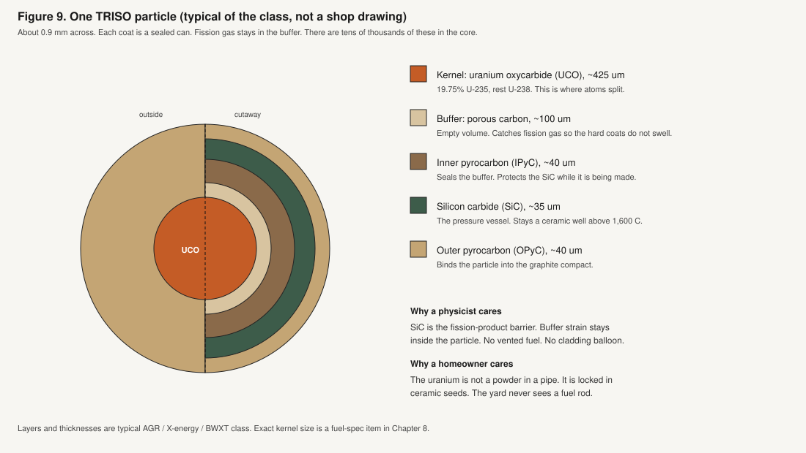

Each kernel is wrapped in three hard ceramic coats, plus a soft carbon layer that acts as a cushion. The stack is called **TRISO** (a name for those three structural coats). Typical of the class, one particle is about **0.9 mm** across, a large grain of sand. The silicon carbide coat is the pressure vessel. The soft buffer is empty volume so gas from splitting has somewhere to sit. There are tens of thousands of these particles in the core. Each one is its own sealed can.

They are pressed into graphite cylinders, about **35%** particles by volume. Those cylinders sit in channels in a graphite block. That block is both the furniture and the thing that slows neutrons.

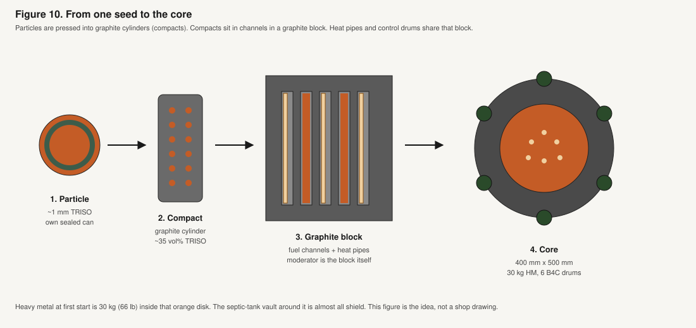

Mixed into the compact, or as separate rods, is a **burnable poison**: a neutron sponge (erbium oxide or gadolinium oxide). It is used up as the fuel is used up, so output stays even for decades and the control drums barely have to move. There is no refueling truck. There is no hatch.

This fuel is not invented here. The same class of coated particles is already made in the United States for other small reactors. This product would license that class, or build from it, at house power. It is not a space machine lowered into a yard.

---

## The core around it

The active core is **400 mm across and 500 mm tall** (about 16 inches by 20 inches). Volume is **62.8 liters**. At **35 kW of heat** that is **0.56 kW per liter**. A typical US water plant packs about **100 kW into each liter**. This core is about **200 times** less dense. That is how a sealed life on the order of a century is even thinkable: the neutron battering that ages metal is much gentler because the power in each liter is small.

Around the fuel is **120 mm** of extra graphite, so the cartridge you would recognize is about **640 mm** across: beer-keg to dishwasher. That extra graphite bounces leaking neutrons back in. Six drums sit in it. Each drum has a face loaded with boron carbide, which eats neutrons. Rotate the absorbing face in, the reaction dies. Rotate it partly out, the reaction holds. Mechanical locks pin the absorbing face in for the truck. Licensed startup is a keyed, two-person rotation to the operating position. The owner key does not exist. A phone app, if there is one, does not move them.

**24 sodium heat pipes** run through the graphite, each about **22 mm** across (a fat marker), down to a cool block in the vault floor. Four spare channels are plugged. A stainless can around the graphite (about 700 mm across, 12 mm wall) holds helium or another inert gas. Design pressure is low, **under 0.5 MPa** (about 70 psi). A US water plant runs about **15 MPa** (about 2,200 psi) in the primary loop. This can is not that kind of pressure cooker.

Above the core, still inside the can, is a hopper of glass grit and boron carbide. That is last-ditch only. It is described with shutdown, not with Tuesday.

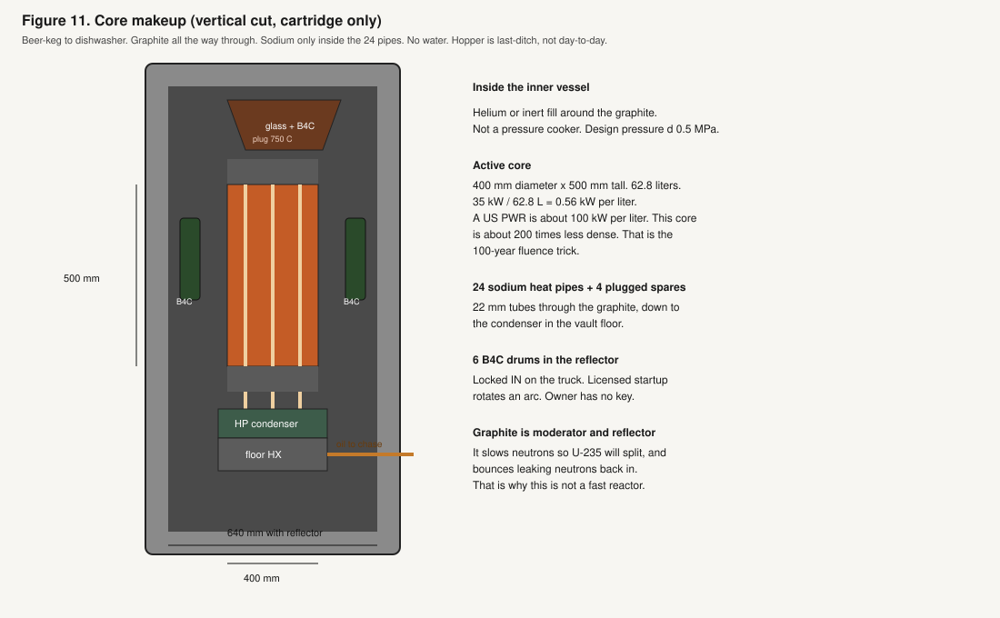

There is no water in the core. There are no swimming-pool rods. Nothing in the core can boil dry. Heat leaves through the sealed pipes. Electricity is made later, in the utility room. The vault is a sealed heater.

---

## How sodium moves, and how the pipes are built

Sodium does not circulate around the core the way water circulates in a water plant. There is no sodium pump and no sodium pool.

Each heat pipe is a closed metal tube with a little sodium inside. The middle of the pipe sits in the hot fuel (**about 650 to 750°C** at the compact). The lower end sits on a cool block in the vault floor. Sodium boils at the hot section. Vapor moves to the cool end (**about 600°C**) and gives up its heat. Liquid soaks into a wick and returns to the hot section by capillary action, the same kind of pull that makes a paper towel drink a spill. No motor. Sodium never leaves that tube. It never mixes with the oil that runs to the house, and it never mixes with house water.

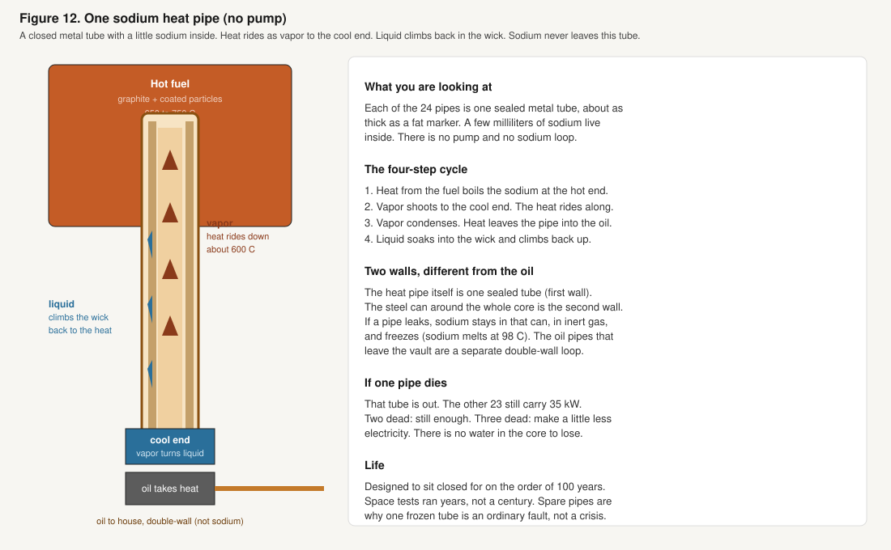

### Are the sodium pipes double-walled?

The **oil** that leaves the vault is double-walled. That oil run goes through the yard in a buried chase, so a leak there is a trench cleanup, and the second wall is there to catch it.

The **sodium** pipes are not double-walled in that same way. Each heat pipe is one sealed metal tube. That is the first wall. The **steel can around the whole core** is the second wall. If a heat pipe leaks, the sodium stays inside that can, in inert gas, and freezes. Sodium melts at **98°C**. A leak is a dead tube, not a sodium fire in the yard, and not sodium in the house pipes.

A second wall on each heat pipe would make the tube worse at dumping heat and is not the baseline. The oil needs its own double wall because it leaves the vault. The sodium is not supposed to.

### How long they last, and whether that is safe

The vault is specified to sit closed for on the order of **100 years**. That is the design life of the heat pipes too. Tests of this class of sodium heat pipe have run for years, not a century in a buried house appliance. That gap is real. It is why there are 24 pipes plus spares, and why a dead pipe is designed as an ordinary fault:

- One pipe dead: the other 23 still carry 35 kW.
- Two dead: still enough.
- Three dead: make a little less electricity.
- The core does not uncover. There is no water to lose.

A frozen pipe is the failure mode. The sodium stays in that tube, or freezes in the inert gas inside the steel can. House water never enters the vault, so the classic sodium-and-water reaction is not the yard accident. An oil leak in the chase is a hazardous-fluid cleanup, not an open core.

On the truck, sodium is a solid until 98°C. Licensed startup uses a little heat on the cool end, or a few pipes filled with a sodium-potassium mix that is already liquid at room temperature, to get the first heat moving. After that the cycle runs itself.

---

## What a neutron does

Heat comes from **fission**: a slow neutron hits a U-235 nucleus, the nucleus splits into two lighter pieces, a few extra neutrons come out, and about **200 MeV** of energy is released. Most of that energy is the fragments flying apart inside the kernel. They stop in a fraction of a millimeter. That stop is heat.

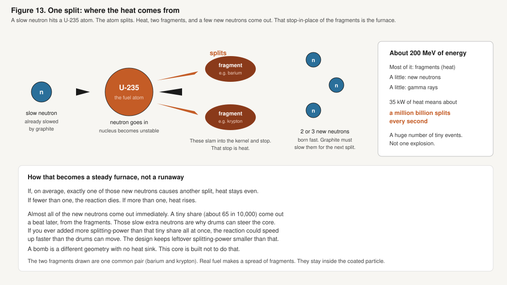

At 35 kW, that is about a million billion splits every second. A huge number of tiny events, not one explosion.

The extra neutrons are born **fast**. U-235 is much more likely to split if the neutron is **slow**, in the thermal range described at the start of this chapter. So the neutron has to bounce off carbon atoms in the graphite many times, losing speed each hit, until it is slow. Then four things can happen:

1. **Split another U-235.** The chain continues. (Later in life, some splits are a different isotope made from U-238.)
2. **Get caught in U-238.** That path slowly makes a little plutonium. Some of that also splits. This is not a breeder. The core is not trying to make more fuel than it uses.
3. **Get caught on purpose** in boron in the drums, in the burnable poison, or in xenon that builds while the core is running.
4. **Leak** out of the core into the shield. Neutrons that leave are the yard problem in Chapter 3. A hydrogen-and-boron layer slows them and eats them. Lead then stops the gamma rays that catching a neutron can create. Lead does almost nothing to neutrons by itself.

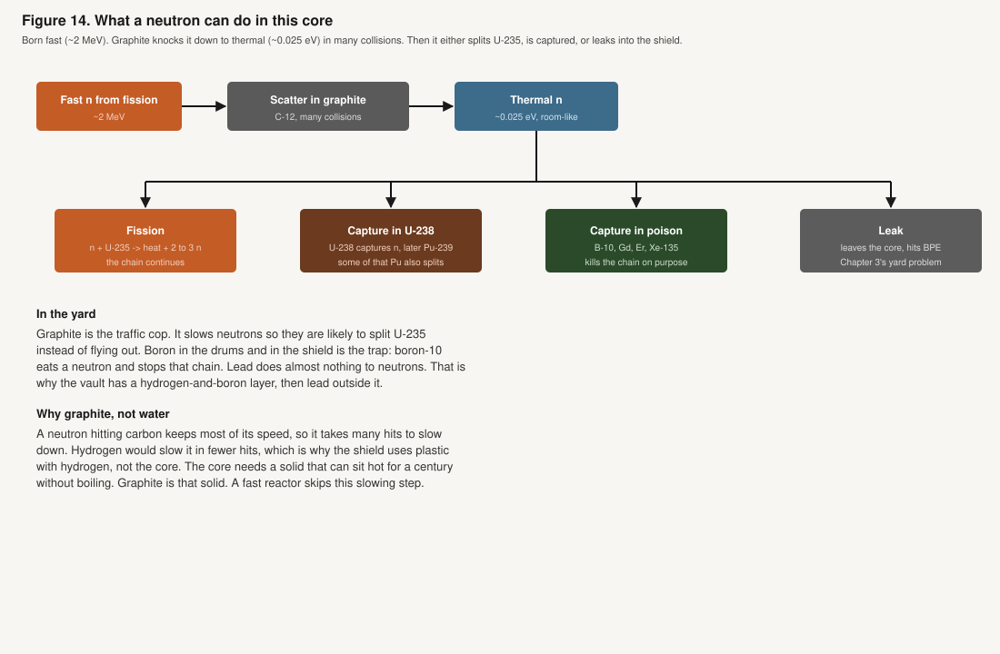

Physicists name the average **k-effective**: if exactly one of those new neutrons causes another split, k-effective is 1, and heat holds steady. Below 1, the reaction dies. Above 1, heat rises.

Almost all of the new neutrons come out immediately. A tiny share, about **65 in 10,000**, come out a beat later from the fragments. Those slow extra neutrons are why drums can steer the core. If you ever added more splitting-power than that tiny share all at once, the reaction could speed up on the immediate neutrons alone, faster than the drums can move. The design rule is: even after the shutdown drums have done their job, leftover splitting-power stays **under eight-tenths of that delayed share**, so a single failure cannot get there.

This is a thermal machine because graphite is there on purpose. A fast machine has no moderator. Neutrons stay fast. Different fuel, different coolant story, different size. Sodium in a heat pipe does not make this core fast. The graphite does the slowing. Sodium only moves heat.

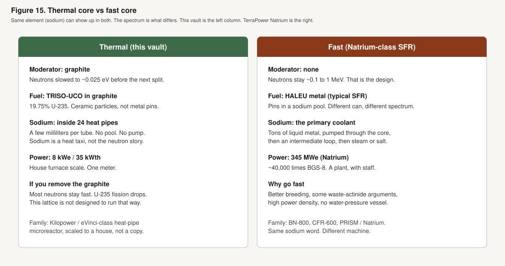

---

## What happens to the atoms over a century

Almost all of the following stays inside the TRISO coats. The lot never sees it.

**At first start:** 30 kg of heavy metal. About 6 kg of that is U-235. About 24 kg is U-238. Plus the burnable poison.

**Splitting:** over 100 years at 35 kW, about **1.35 kg** of U-235-equivalent actually splits. Some of those splits, later in life, are plutonium. The 1.35 kg is “the energy of that much U-235,” not a claim that only U-235 splits. The fragments include noble gases (xenon, krypton) held in the buffer, iodine, cesium-137, strontium-90, and a spread of others. Xenon-135 is a strong poison while the core is running; it builds and is used up as power holds. These fragments are why used fuel is still “hot” after neutrons stop: leftover heat and gamma rays from the fragments, fading on a known curve.

**U-238’s side path:** U-238 catches a neutron, becomes U-239, becomes neptunium-239 in about 23 minutes, then plutonium-239 in about 2.4 days. Some of that plutonium-239 splits and helps the century.

**Poison:** the gadolinium or erbium is eaten as the fuel is used, so drums move a few degrees per decade, not weekly.

**At end of life:** about **16 kg** of heavy metal has been consumed (the engineering target). About **14 kg** remains in the same particles, plus fission products. Several kilograms of material that can still split are still there. End of life is a geometry and poison problem, not an empty tank. What cannot be recycled is still paint-can class, at a licensed site (Chapter 7).

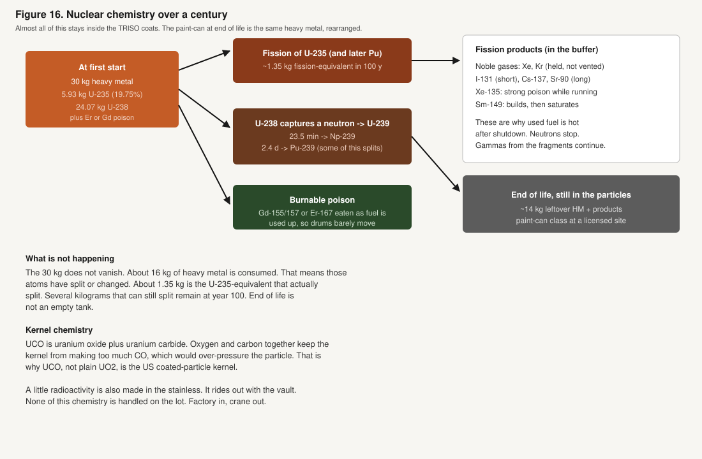

A little radioactivity is also made in the stainless of the can and the heat-pipe walls. It is real and small at this low power density. It rides out with the vault. It is not a yard waste stream.

---

## Why these choices are the safety case

Nobody has stamped this vault “the safest option possible.” What the design does is stack choices that remove the accident paths a water plant and a sodium-pool plant have to manage at plant scale. Each layer is a materials fact or a size fact, not a software mode.

**1. Size.** 8 kW of electricity is about 1/100,000 the electrical size of a 1,000 MW plant. Leftover heat after shutdown is a space heater, then less. A 10-second jump at 35 kW is **350 kJ**, a tenth of a kilowatt-hour, into a lot of graphite and a 42-ton box. There is no plant-scale inventory of leftover heat to dump into a neighborhood.

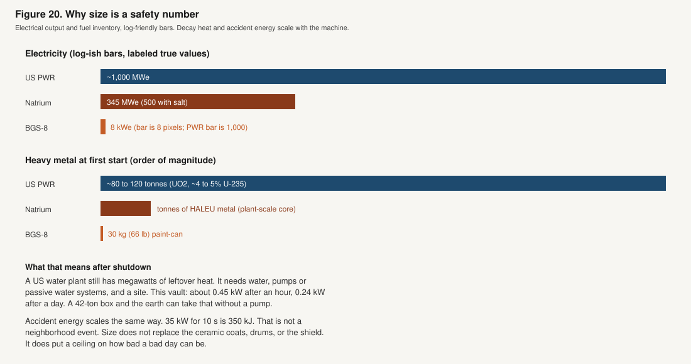

**2. Ceramic cans, many of them.** Each TRISO particle is its own pressure vessel. Silicon carbide stays a ceramic well above 1,600°C. The compact runs at 650 to 750°C. Gas from splitting stays in the buffer. There is no zirconium tube to balloon, and no open fuel.

**3. No water in the core.** The core cannot lose its water, because there is none. There is no steam explosion from a flooded hot core, and no zirconium-steam hydrogen. Flood water outside the vault is extra shield and extra cooling. If the inner can ever flooded, the engineering requirement is that the reaction dies or stays dead. That is an analysis item, not a slogan.

**4. Heat pipes fail in place.** A dead pipe is a frozen tube. Spare capacity covers one or two. No pump in the vault is required to cool the core or to take leftover heat after shutdown.

**5. Heat itself applies a brake.** When the fuel gets hotter, U-238 becomes better at catching neutrons (the energy traps in the nucleus look wider). Fewer neutrons are left to split. Milliseconds. No moving part.

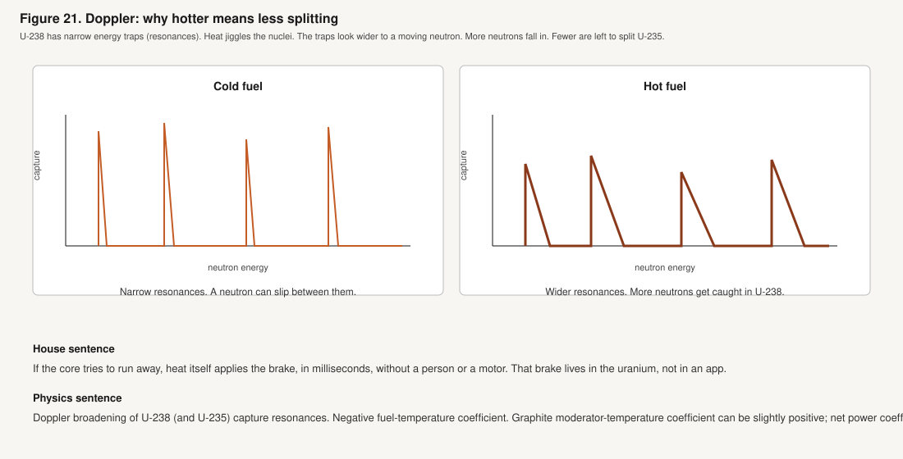

Graphite, getting hotter, can go slightly the other way in some layouts. The core must be laid out so that from room temperature to 750°C, hotter still means less splitting overall. That is a hard requirement on the computer model of the core, not a hope.

**6. Little leftover splitting-power.** After the shutdown drums have done their job, leftover splitting-power stays under eight-tenths of the delayed-neutron share, so one failure cannot run away on the immediate neutrons. The burnable poison holds the long century so drums are not chasing a large swing.

**7. Drums, then earth.** If the oil pump dies, or the engines in the utility room stop, or someone shears the chase, the cool end of the heat pipes gets hotter. A spring or a melt-link, with no software, drives the drums in. Leftover heat soaks into the 42-ton box and the soil. The owner phone is not in the chain.

**8. Last-ditch glass.** If the vault ever got to about 750°C at a fusible plug, glass and boron carbide pour and set. That layer is not counted on until a furnace test exists. The design is meant never to get there.

What this stack does **not** claim: a 100-year sealed yard life is already proven. It is not. Coated particles, heat pipes, and drums are proven in pieces, at other sizes and other lives. Graphite shrinkage and the ceramic coats at this exact neutron dose still need a materials assessment. The lawn dose has a target; the transport model has not yet signed it. Those are real. They are not the same as a water-plant loss-of-coolant accident at a gigawatt.

The safety case is: the accident energy is small, the fuel is already in ceramic cans, there is no water to lose from the core, sodium cannot drain the core, leftover heat is a household object, and heat itself plus drums plus size are the brakes. That is as far as first principles will take a design that has not yet been built.

---

## How the reaction stops, and when it would not

Four layers, fastest first.

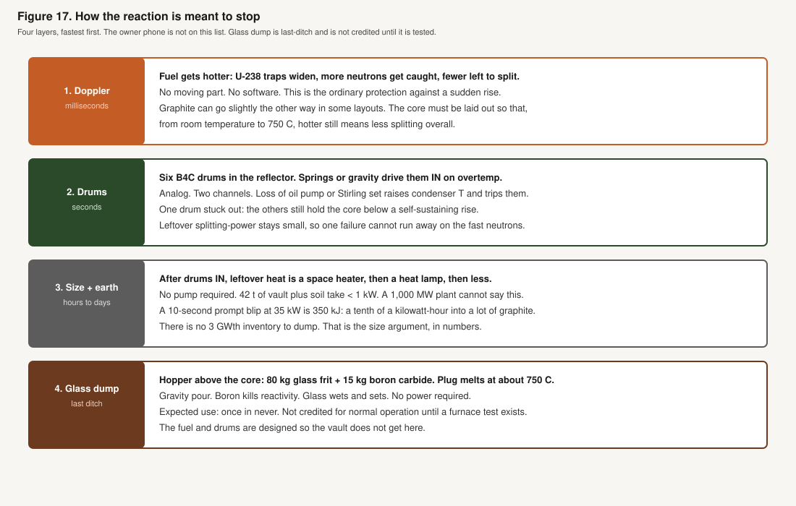

**Ordinary Tuesday.** The core is held just barely self-sustaining, with drums on a slow arc. House loads (dryer, air conditioner) are the battery’s job. The core is not asked to follow the dryer.

**Sudden rise in splitting.** Heat itself applies the brake, in milliseconds. The delayed neutrons keep the rise slow enough to steer. Leftover splitting-power is small by requirement.

**Loss of the heat path** (oil pump off, engines off, excavator shears the chase). The cool end of the pipes gets hotter. A mechanical link releases the drum springs. Leftover heat goes to the box and the earth. An oil leak is a trench or utility-room cleanup, not an open core.

**One or two heat pipes dead.** Margin in the pipe count. The core stays covered because there is nothing to uncover.

**Grid loss.** The vault does not care. The house needs the backup switch (the gateway) or it goes dark. That is Chapter 4, not a core event.

**Flood.** External water: more shield, more cooling. The inner can is supposed to stay dry. If it does not, the reaction must die or stay dead.

**One drum stuck with the absorbing face out.** The other five still hold the core below a self-sustaining rise.

**All drums out, cold, never-used fuel** (beyond design). Still below the point where the immediate neutrons could run away, by the leftover-splitting-power rule. That is a requirement on the model of the core, not a measured number in this chapter. Do not invent one.

**What would not shut it down by itself:** a phone app. A thermostat. A utility outage. Those are not in the chain, on purpose. **What is not a shutdown:** “the dirt will save us.” Dirt is bonus. The vault is the shield. Drums and the heat-brake are the reaction brakes.

**Glass dump** runs only if the plug reaches about 750°C. Normal vapor in the pipes is about 600°C. Expected use: once in never.

---

## How this is not a US water plant

Almost every commercial reactor in the United States uses water as both the thing that slows neutrons and the thing that carries heat. Two families.

A **pressurized-water reactor** keeps water liquid in the core at about 15 MPa and makes steam in a second loop. A **boiling-water reactor** boils in the core and sends that steam to the turbine. Both use uranium-oxide pellets in zirconium tubes at about 4 to 5% U-235. Both are about 1,000 MW of electricity. Both have a large leftover-heat problem after shutdown. Both have to design against losing the water: if the water leaves, the fuel can overheat. Hot zirconium and steam can make hydrogen. That is a water-reactor path. It is not this vault’s path.

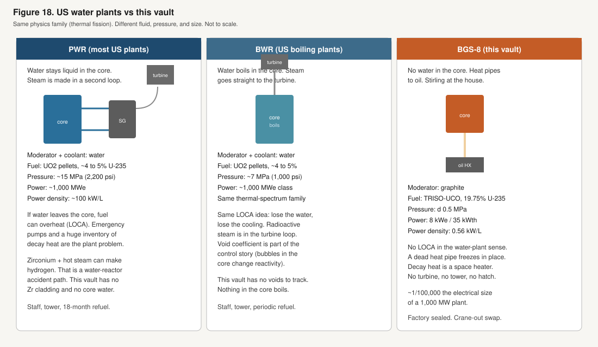

| | Typical US pressurized-water plant | Typical US boiling-water plant | This vault |
| --- | --- | --- | --- |
| Job | Grid plant | Grid plant | One house |
| Electricity | about 1,000 MW | about 1,000 MW | 8 kW |
| Neutrons | Slowed by water | Water | Slowed by graphite |
| Heat carrier | Pressurized water | Boiling water | Sodium in sealed pipes, then oil |
| Fuel | Oxide pellets, about 4 to 5% U-235 | Same idea | Coated particles, about 20% U-235 |
| Heavy metal | about 80 to 120 tonnes | similar | 30 kg |
| Core pressure | about 15 MPa | about 7 MPa | under 0.5 MPa |
| Heat per liter | about 100 kW per liter | high, similar class | 0.56 kW per liter |
| Electricity made by | Steam turbine | Steam turbine | Stirling engines in the utility room |
| After shutdown | Megawatts of leftover heat | Megawatts of leftover heat | A space heater, then less |
| Opened on site | Refuel floor, about every 18 months | Same idea | Never. Crane-out swap |

This vault is furnace-scale fission in ceramic particles. Neutrons are in the same slow range as a US water plant. It does not share the water, the pressure, the pellet-in-tube fuel, or the leftover-heat problem.

---

## How this is not a sodium-pool plant

Sodium shows up in the next plants being built, and that word will get this vault lumped in with them. It should not. The rest of this section is for readers who already know those machines, or who will hear the names.

NASA ran a small heat-pipe core on the ground (Kilopower / KRUSTY). Westinghouse is designing a larger heat-pipe machine (eVinci) for mines and towns. Those are the family this vault is built from: sealed sodium tubes, no vault pump, drums, coated-particle or similar high-temperature fuel. This product is that class pointed at one house, not a copy of either machine.

**TerraPower Natrium**, under construction at Kemmerer, Wyoming (construction permit March 2026, nuclear construction started April 2026), is a different family. It is a **345 MW sodium-cooled fast reactor** with molten-salt storage that can push output to **500 MW** for hours. The fuel is HALEU metal. Neutrons stay fast on purpose. There is no graphite. Sodium is the primary coolant: **tons**, in a **pool**, with pumps, then an intermediate sodium loop, then salt and steam. Staff on the order of hundreds. It is a plant on a retiring coal site. Electrically it is about **40,000 times** this vault.

That design has real advantages at plant scale: low pressure versus a water plant, a large sodium pool as a heat sink, no water in the primary. It also has plant-scale sodium inventory, pumps, intermediate loops, and a fast-spectrum core. Those are solved with plant engineering. They are not the house problem, and this vault does not take them on.

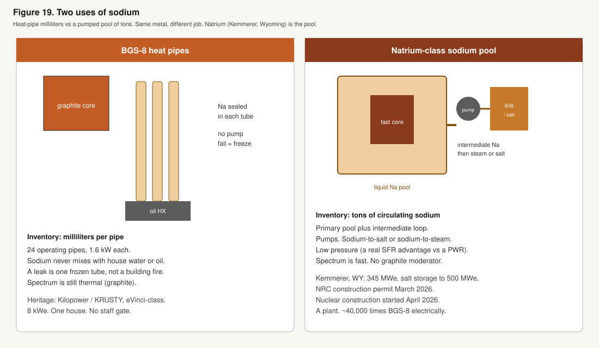

The same sodium-pool family, elsewhere: Russia’s BN-800 (operating), China’s CFR-600, India’s long-delayed PFBR. All are fast, hundreds of megawatts. Hyperion’s old “hot tub” pitch was also a small *plant* (25 to 30 MW), not this object.

| | Natrium (Kemmerer, Wyoming) | This vault |
| --- | --- | --- |
| Customer | Grid, coal-site replacement | One house |
| Electricity | 345 MW (500 with salt) | 8 kW |
| Neutrons | Fast (no moderator) | Slowed by graphite |
| Sodium | Tons, pumped pool plus another loop | Milliliters, sealed heat pipes |
| Fuel | HALEU metal, plant core | Coated particles, 30 kg |
| Electricity made by | Steam plus salt storage | Stirling engines in the utility room |
| Staff | about 250 full time (plant figure) | None on the lot |
| Approval | NRC construction permit, 2026 | Size-based appliance path, does not exist yet |

If someone asks whether this is “the Wyoming reactor in a backyard,” the answer is no. Same metal in a sentence. Different speed of neutrons, different amount of sodium, different job.

---

## What this chapter covered

The fuel is coated uranium particles in graphite, about 30 kg at first start, about 20% U-235. Neutrons are slowed by graphite, not by water, so they travel in the thermal range. This is not a fast reactor. Sodium lives in 24 sealed tubes. Each tube is one wall; the steel can around the core is the second. The oil that leaves the vault is the loop that is double-walled. A dead heat pipe freezes in place. The pipes are specified for a century; tests so far are years; spares are why that gap is a materials job, not a yard accident.

The chain is held by heat itself, by drums, by little leftover splitting-power, and by size. Chemistry stays in the particles. US water plants and sodium-pool plants are different machines. Chapter 5 is the vault as a box. Chapter 8 is the engineering tables. Chapter 10 is what still has to be shown before a stamp. Chapter 3 is the grass. Chapter 7 is the paint-can at the end. The yard never needs a hatch, and the owner never holds a drum key.

---

You have finished chapter 9 of 10.

**Next chapter:** [10. The Proofs](10_The-Proofs.md)

← [Previous: 8. Vault Spec](8_Vault-Spec.md) · [Start](README.md) · [Whole book as a PDF](Backyard-1.6.pdf) · **Next:** [10. The Proofs](10_The-Proofs.md) →

**Chapters:** [1. The Need](1_The-Need.md) · [2. The Idea](2_The-Idea.md) · [3. Yard Safety](3_Yard-Safety.md) · [4. The House](4_The-House.md) · [5. The Vault](5_The-Vault.md) · [6. The Approval](6_The-Approval.md) · [7. The Swap](7_The-Swap.md) · [8. Vault Spec](8_Vault-Spec.md) · **9. The Fuel** · [10. The Proofs](10_The-Proofs.md)

